# evidence log — evidence log

Exported 2026-08-06 17:31. 77 entries, oldest first. Append-only: withdrawn claims are still here and marked, because the reason a decision changed is part of the record.

## `e001` Dataset geometry — and it kills full 3D pose

*FOUND — **CONFIRMED** · 2026-08-04 15:08:21*

Probed the 18.5 GB file. Three of these numbers constrain the whole design.

**Why:** The plan assumed a resolvable volume. It is not one: a ~35 um granule sampled at a 40 um z-step occupies about ONE plane, so consecutive planes are largely independent sections rather than views of the same objects. Full 3D orientation and out-of-plane tilt are therefore not identifiable from this acquisition.

| | value | note |
|---|---|---|

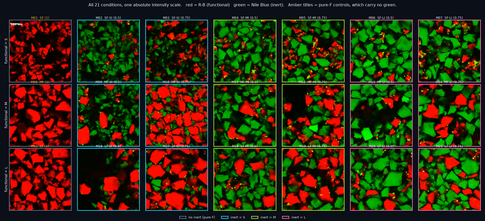

*All 21 conditions on ONE absolute intensity scale, laid out in the design grid: functional size increases down the rows, inert size across the columns. The three amber-titled panels are the pure-F controls and carry no green, which is the visual form of the whole experimental design.*

---

## `e002` Build dimension-generic: 2D now, 3D later

*DECISION — **CONFIRMED** · 2026-08-04 15:08:21*

Every node sits behind the repo's existing 2D/3D lever. Fits superellipses with an in-plane angle on this data; the identical nodes fit full 3D pose on a future 5-10 um z-stack.

**Why:** Costs ~20% more now and avoids reopening every node later. Forcing 3D on 7 planes would produce rotations that are numerically confident and physically meaningless.

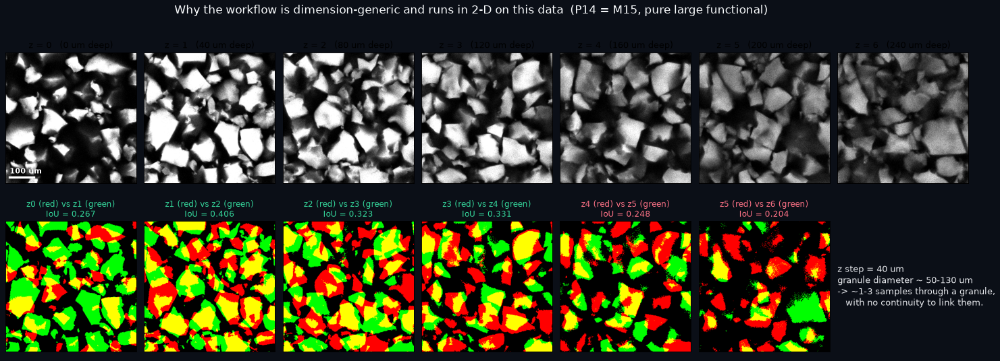

*The measurement behind this decision — and see e019, which corrects how strongly I stated it.*

---

## `e003` Increment 0 built — all four gates green

*DID — **CONFIRMED** · 2026-08-04 15:08:21*

Cleared the ground: no new nodes, catalog unchanged at 72 ops.

**Why:** Two of these were blockers rather than tidying. `_shared/objects.py` refused EVERY volumetric table and `_object_velocity` had no vz at all, so on this 3D data there was no per-object motion column of any kind — half the deliverable was unavailable.

| | value | note |
|---|---|---|

---

## `e004` I set the size prior from a measurement I never looked at

*MY ERROR — **REJECTED** · 2026-08-04 15:08:21*

I reported R_bar = 12.8 um and 7x polydispersity from an EDT h-maxima pipeline, and wrote it into the plan as fact. It was wrong by several fold.

**Why:** I already had evidence the front end was broken — an earlier study measured 914 of 1002 foreground components seedless and h-maxima missing 51% of objects. That should have told me the seed set was unfit for measuring size, instead of being something to measure WITH. In a merged blob the EDT maximum is the inscribed radius of the merge, not of a granule. The arithmetic was fine; trusting an unviewed pipeline was not.

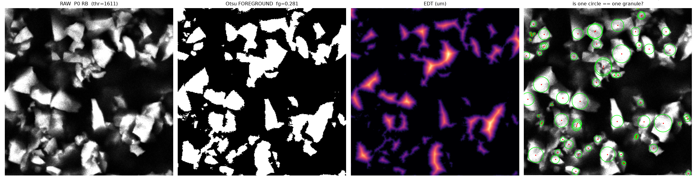

*The figure I should have made BEFORE writing the number into the plan.*

---

## `e005` Visual QC: the seeds and circles do not correspond to granules

*FOUND — **CONFIRMED** · 2026-08-04 15:08:21*

Rendered the actual fields. The foreground merges neighbours and drops dim granules; at P5 the EDT ridges form a connected branching network, which is the signature of INTERSTITIAL space rather than compact convex bodies — so many seeds are gap centres, not granule centres, and small circles cluster on bright speckles.

**Why:** This is the check that should have happened before the number reached the plan.


*P0 c1. Panel 4: green = inscribed circle per seed. Note multiple circles inside one granule, circles spanning merged blobs, and clearly visible granules with no circle at all.*

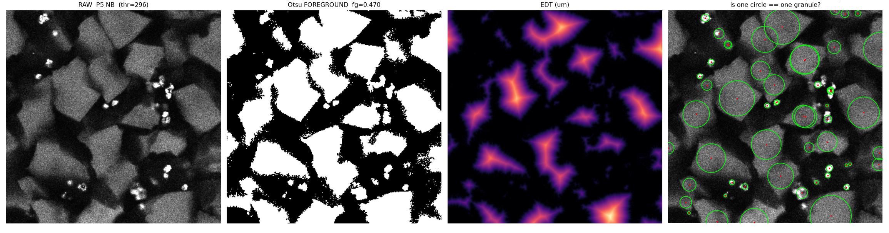

*P5 c2. The EDT (panel 3) is a branching network, not one blob per granule — the tell that the foreground is not the granule bodies.*

---

## `e006` Segmentation-free size: a bracket, not a number

*FOUND — **CONFIRMED** · 2026-08-04 15:08:21*

Remeasured from statistics of the binary phase rather than per object, so merging does not inflate it. For any convex body the Cauchy relation gives mean chord `Lbar = pi*A/P`, hence `D_eff = 4A/P` — the mean-caliper diameter, shape-robust (a disc of diameter D and a square of side a both return D or a).

**Why:** A circle fit is the wrong instrument for angular shards, and any per-object size inherits the unsolved instance segmentation. But the result still brackets rather than pins: D_eff is a LOWER bound (a ragged perimeter inflates P) and Feret p50 is an UPPER bound (merging inflates it). The chord histograms prove the mask is not yet clean convex bodies — a convex population scanned by parallel lines should peak NEAR the body size, but every field decays monotonically with a spike in the shortest bin.

*The two columns bracket the truth from opposite sides.*

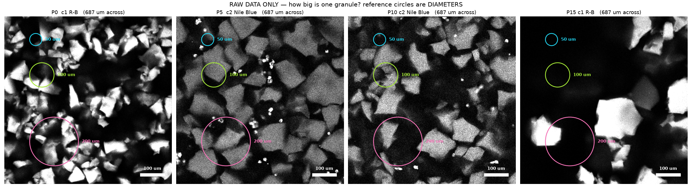

*Raw only, reference circles are DIAMETERS, 100 um scale bar.*

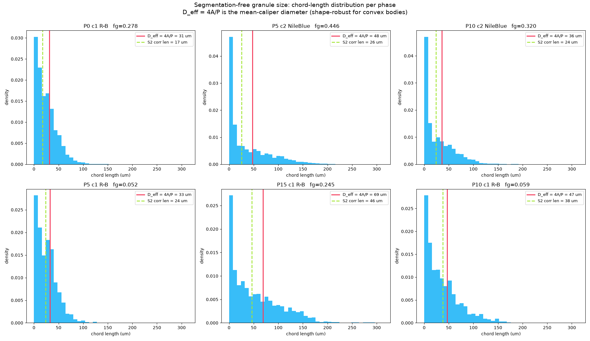

*Chord-length distributions. The short-bin spike is haze and ragged edges — the contamination that makes D_eff a lower bound.*

---

## `e007` GFP bleeds into Nile Blue — unmixing is mandatory

*FOUND — **REJECTED** · 2026-08-04 15:08:21*

Crosstalk measured at alpha ~ 0.30 (P5) and 0.38 (P10). Nile Blue reads p50 = 945 at strong-GFP pixels against 250 globally.

**Why:** This explains the bright speckles I first mistook for structure, and it is why small spurious seeds landed on them. Unmixing must run BEFORE any threshold or classification or every dot-bearing granule is mis-called.

```
NB_corrected = clip(NB - alpha*(GFP - GFP_bg), 0, None)

Also measured: the two populations are COMPLEMENTARY and interlocking —
  Jaccard overlap  0.004 - 0.011   (essentially zero)
  => porosity must use the UNION of both body channels; one channel's
     'packing fraction' is only that population's volume fraction.
```

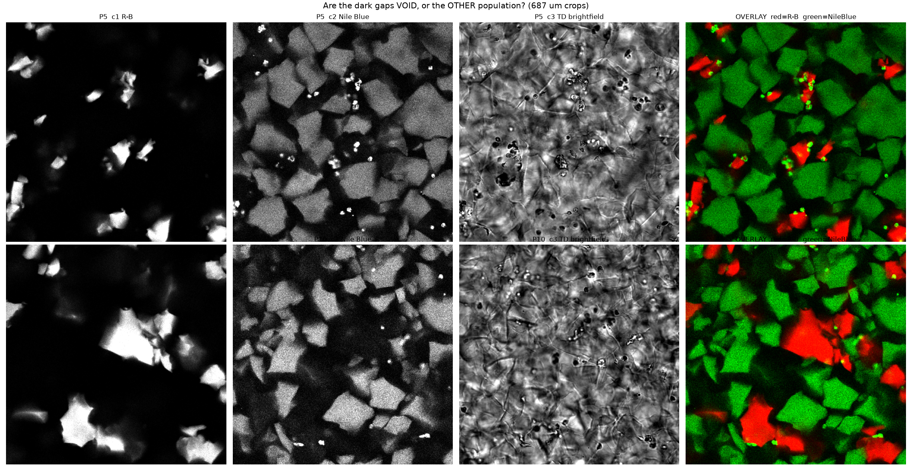

*red = R-B, green = Nile Blue. They tile into each other. TD (panel 3) shows a fibrous texture, NOT granule outlines — so the proposed TD contact-plane term is unusable and I dropped it.*

> **Their note:** **Retracted.** The alpha I reported here is an artefact of the regression, not optical crosstalk — see e014 for the evidence and e015 for the consequence. The complementary-populations finding in this entry still stands; only the unmixing conclusion is withdrawn.

---

## `e008` Shape model: convex polytope, not superellipsoid

*DECISION — **CONFIRMED** · 2026-08-04 15:08:21*

Your call, and it makes the plan smaller rather than larger.

**Why:** For a polytope with unit face normals, `s(x) = max_i (n_i . x - d_i)` is negative inside, zero on the faces and convex — it IS the signed-distance function the Gibbs energy and probability field were already built on. So it drops the entire superellipsoid apparatus (exponent grid search, radial residual, analytic Jacobian, roughness/exponent confounding) and reuses two things already in the repo: `analysis.tessellate boundary=convex_hull` and the convex rasterization path.

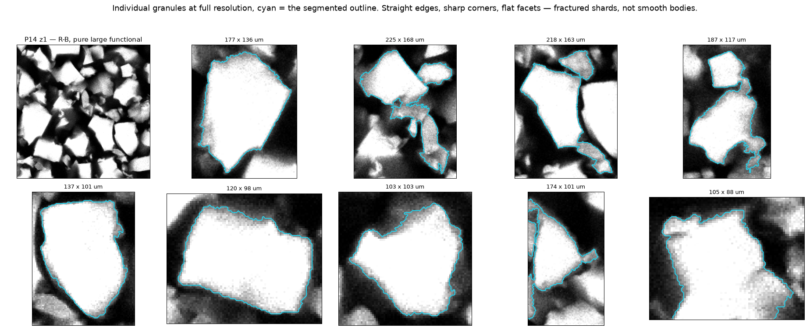

*Individual granules at full resolution: convex polygons with straight edges and sharp corners.*

---

## `e009` Position -> condition mapping VERIFIED (P = M number - 1)

*FOUND — **CONFIRMED** · 2026-08-04 15:08:21*

You gave the 21-condition design, so I tested the mapping against three falsifiable predictions instead of assuming it. Two of them settle it.

**Why:** The S-block functional size reads 31.5, 31.5, 32.0, 31.9, 31.5, 32.8, 31.4 um across seven INDEPENDENT positions — a 1.4 um spread. That is the same material measured seven times, not chance. And the inert size cycles S,S,M,M,L,L inside every block of seven, reproducing in all three blocks.

*Inert `D_eff` per block — the S,S,M,M,L,L cycle repeats three times.*

| | value | note |
|---|---|---|

**Diagnosis that matters:** D_eff under-reads and the deflation GROWS with size — the L block reads ~59 um against a >100 um nominal. That means Otsu is **fragmenting the large granules**, inflating perimeter and collapsing 4A/P. Direct evidence that the foreground stage is the dominant error source, and the 21 conditions are now the calibration set to fix it against.

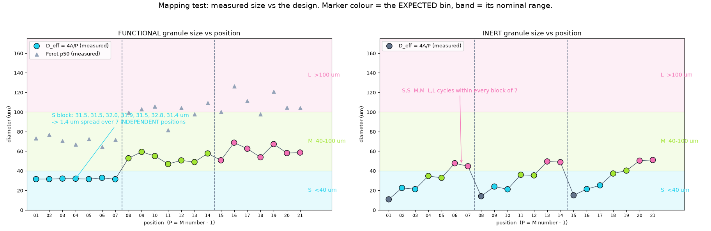

*Marker colour is the EXPECTED bin and the shaded band its nominal range, so a correct mapping puts each point in its own colour's band. LEFT: the functional block steps S -> M -> L, and the seven S-block positions land in a 1.4 um band. RIGHT: inert size cycles S,S,M,M,L,L inside every block of seven. Note also that both estimators sit BELOW the L band — the direct visual signature of large granules being fragmented by the threshold.*


*The same claim by eye: read down for functional size, across for inert.*

---

## `e010` My bleed estimator is buggy — caught by the same test

*MY ERROR — **REJECTED** · 2026-08-04 15:08:21*

Per-position alpha came out 0.00 - 0.91. That is not physical: optical crosstalk is fixed by the filter set and should be one number for the dataset.

**Why:** The estimator regresses Nile Blue on GFP over strong-GFP pixels — but the dots sit ON the F granules, so wherever both channels are legitimately bright it over-attributes NB to bleed. At P20 (alpha = 0.73) it subtracted the real Nile Blue away entirely: a condition that should carry 25% inert collapsed to I_fg = 0.010.

**Fix:** one GLOBAL alpha, calibrated at the pure-F conditions (M01/M08/M15 = P0/P7/P14) where there are no inert granules, so all Nile-Blue signal is bleed plus autofluorescence. Note the current estimator returns alpha ~ 0.00-0.01 at exactly those positions — its 99.7th-percentile cut finds too few pixels there — so it fails precisely where the calibration belongs. Needs an absolute-intensity criterion, not a percentile one.

**Confirming detail:** at the pure-F positions the residual Nile-Blue signal has D_eff = 10.8 / 14.0 / 15.0 um, versus 21-51 um wherever inert granules genuinely exist. So 'are there inert granules here' should be judged by the LENGTH SCALE of the signal, not its area fraction — my area-based check reported a false mismatch on all three controls.

> **Their note:** **Superseded.** The variation is real but my proposed fix (one global alpha) was wrong too — there is no bleed to fit. See e014.

---

## `e011` Two calls before I build further

*NEEDS YOU — **CONFIRMED** · 2026-08-04 15:08:21*

Both follow directly from the findings above and both are cheap to get wrong expensively.

**Why:** The L-block size deflation says granule fragmentation is what limits every downstream number, so foreground quality gates everything. And alpha feeds the F/I classifier, so a wrong alpha mis-labels populations rather than just adding noise.

**What I need from you:** **(1) Global alpha** — shall I calibrate one dataset-wide bleed coefficient at P0/P7/P14 with an absolute-intensity criterion, and show you the before/after on the pure-F controls (where corrected Nile Blue should go essentially empty)?

**(2) Foreground next** — do I go after the fragmentation of large granules (CellSAM foreground vs Otsu, scored against the 21 known S/M/L conditions) before touching any of the shape-fit or probability-field work? My read is yes: nothing downstream can be calibrated while the L block reads 59 um against a >100 um nominal.

> **Their note:** **(1) No global alpha** — the variation is not yet understood, so do not collapse it. **(2) Yes to foreground next**, and the reason generalises: multiple sources of data all trying to do the same thing, fused the way a classifier trains on several kinds of analysis.

---

## `e012` No global alpha — characterise the variation instead

*DECISION — **CONFIRMED** · 2026-08-04 15:49:39*

Declined. I will not fit one dataset-wide bleed coefficient until it is understood what makes the measured slope move.

**Why:** On reflection this is the right call and my framing was too quick. What I measured is not optical crosstalk — it is a regression slope that conflates **three** things: true bleed-through (fixed by the filter set, so genuinely constant), F-granule **autofluorescence** in the Nile Blue band (follows the granule BODY, not the dots, so it is NOT proportional to GFP and subtracting `alpha*GFP` is the wrong model for it at any alpha), and the spatial **correlation** between dots and NB-positive material, which is a pure regression confound. Calling the spread a bug assumed the first and ignored the other two.

**The decisive test, now running.** At the pure-F controls (P0/P7/P14) there are no inert granules, so every bit of Nile-Blue signal above background must be bleed or autofluorescence. Comparing NB in three disjoint masks separates them:

  `DOT` (GFP puncta) elevated only  -> optical bleed, alpha is meaningful
  `BODY` (granule interior, no puncta) elevated too -> autofluorescence, a different correction entirely

Second test: does the per-position slope correlate with a **design** variable (inert fraction, inert size, F size)? If it does, it cannot be optical crosstalk — the filter set does not know what is in the well.

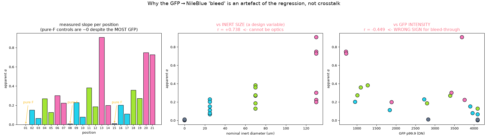

*What characterising rather than imposing the coefficient revealed.*

---

## `e013` Architectural: fuse multiple methods as evidence, don't pick a winner

*DECISION — **CONFIRMED** · 2026-08-04 15:49:39*

Your framing — several analyses all attempting the same task, combined the way a classifier trains on multiple kinds of data — becomes a design principle rather than a one-off for the foreground step.

**Why:** It fits what is already planned better than the plan's own framing did. The core of V2.22 is a per-voxel Gibbs posterior that SUMS energy terms, so an ensemble is its natural shape: each method contributes a term, and the 21 known conditions supply supervised labels to fit the weights. That directly retires two risks I had flagged as hand-tuned constants — the surface-energy weight (which I measured as inert at 1.12 px) and the uncalibrated intensity weight. It also reframes an earlier finding: the tessellation study measured where watershed, the power diagram and nearest-surface DISAGREE, and under this framing that disagreement is not a nuisance to resolve but a second, independent per-voxel confidence channel.

*Where the principle applies, and what supervises each.*

**Node consequence, charter-clean.** This needs one generic fusion node, not method-choice bolted into each existing one. A comma-separated `sources` socket naming N layers is the established pattern in this repo (`analysis.measure` stats, `object_metrics` metrics), so it needs no variable-socket machinery: run `analysis.segment` several times into differently-named layers, then fuse with a `rule` Mode (union / intersection / majority / weighted / ranked). It also argues `analysis.segment` should keep every method available rather than one becoming canonical. And the per-voxel **agreement count** is just a float VOXEL layer, so `view.overlay` visualises it for free — same as the probability field.


*The concrete case for fusing rather than choosing: D_eff is right for S and M, Feret is right for L, and 21 labelled conditions are available to fit the combination.*

---

## `e014` There is NO meaningful GFP->NileBlue bleed. The 'alpha' was measuring inert granules.

*FOUND — **CONFIRMED** · 2026-08-04 15:50:47*

Holding off on the global alpha was right, and for a stronger reason than either of us gave: the alpha*GFP model is **misspecified**, so no value of alpha would have been correct.

**Why:** Two independent results say the measured slope is not optical crosstalk. First, at the three pure-F controls alpha is **0.000 / 0.007 / 0.009** — essentially zero — and those are the positions with the MOST GFP (p99.9 saturated at 4095 / 4095 / 2828). Real bleed-through would be LARGEST where GFP is brightest; it is smallest. Second, the slope correlates with **inert size at r = +0.738** and with GFP intensity at **r = -0.449** — the wrong sign. A filter set does not know what is in the well, so a slope that tracks the inert granules is measuring the inert granules. Mechanism: my estimator regresses NB on the top 0.3% of GFP pixels; in a field crowded with large bright inert granules those pixels sit near Nile-Blue material for reasons unrelated to GFP, inflating the slope.

***Part 1** — at the pure-F controls there are no inert granules, so all NB above background is bleed or autofluorescence. Splitting it three ways separates them (median DN, 12-bit).*

| | value | note |
|---|---|---|

**My correction was doing harm, not nothing.** At P20 the estimator returned alpha = 0.727 and subtracting it collapsed a condition that should carry 25% inert to `I_fg = 0.010` — it deleted the real Nile-Blue signal. That is worse than leaving the channel alone.

**What the real contamination is, and the right fix.** The only genuine effect is a small **autofluorescence pedestal** of ~+10 DN on the F-granule bodies (void 53 -> body 63). It follows the granule BODY, not the GFP intensity, so it is not an unmixing problem at all. And it is far below real inert signal — Nile-Blue Otsu thresholds at genuinely mixed positions run 180-1706 DN. The reason it caused trouble is that at the pure-F controls Otsu has **no real signal to threshold**, so it settles at 69 DN, right on top of the pedestal, and reports 22-25% phantom inert.

So the fix is a **threshold floor / per-object baseline**, not a channel subtraction: compare each granule's median NB against the pedestal rather than thresholding the NB image and trusting the mask. This also removes a step from the pipeline instead of adding one.


*Three views of the same conclusion. LEFT: the apparent slope per position — the three pure-F controls sit at ~0 despite carrying the MOST GFP (saturated), which is backwards for bleed-through. MIDDLE: it tracks inert SIZE, a design variable the filter set cannot know about. RIGHT: it correlates NEGATIVELY with GFP intensity — the wrong sign. Colour = inert size throughout.*

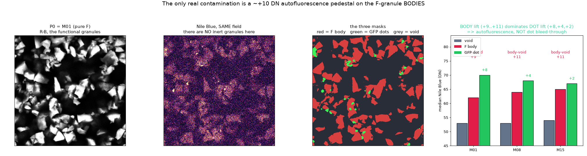

*What IS there, at a pure-F control where no inert granule exists. Nile Blue (panel 2) is visibly elevated over the functional granule BODIES rather than over the GFP dots. Panel 4 quantifies it: the body lift (+9 to +11 DN) dominates the dot-specific lift (+8, +4, +2), so this is autofluorescence and no multiple of GFP can correct it.*

---

## `e015` Confirm: drop the unmixing step entirely?

*NEEDS YOU — **REJECTED** · 2026-08-04 15:50:47*

I want your read before I edit the plan's preprocessing stage, since this reverses something I told you was mandatory two messages ago.

**Why:** The evidence says the alpha*GFP unmixing should be **deleted**, not tuned: there is no bleed to remove, and applying it destroyed real signal at P20. The autofluorescence pedestal is real but is handled downstream by a threshold floor or a per-object baseline in the classifier.


*The evidence for deleting the unmixing step.*


*And for what replaces it — a body-localised pedestal, not a GFP-proportional bleed.*

**What I need from you:** **Drop the GFP->NB unmixing step, and handle the ~+10 DN F-granule autofluorescence pedestal as a threshold floor / per-object baseline instead?** The one thing I cannot rule out from images alone is whether the pedestal is genuine granule autofluorescence or something in your prep that fluoresces faintly in the 649 band — if you know, that changes whether it is a fixed constant or something to measure per batch.

> **Their note:** **NOT deleted — relocated.** I proposed removing the unmixing step entirely. The correct scope is narrower and more specific than either of my two positions: unmix **only inside the small bright dual-channel objects (the cells)**, never across the whole image. A pixel-wise `NB - alpha*GFP` over the full frame was always wrong, but so was deleting the idea.

---

## `e016` The two size estimators CROSS OVER — and that is your ensemble idea, concretely

*FOUND — **CONFIRMED** · 2026-08-04 16:24:17*

Plotting them against the known bins shows the biases are not just opposite in sign, they swap which one is right depending on size.

**Why:** `D_eff` lands inside its own band for S and M (31-33 um and 47-59 um) and falls SHORT for L (50-69 um against a >100 um nominal). Feret does the reverse: right for L (98-126 um) and far too high for S (65-77 um against <40 um). So neither is the estimator — but the two together, with 21 labelled conditions to fit against, are a two-feature supervised calibration. This is the first concrete instance of the fusion principle rather than an argument for it.

The inert panel shows the same crossover plus a clean secondary confirmation: the three grey points (pure-F positions, where **no inert exists**) sit at 11-15 um, distinctly below every genuine inert measurement (21 um and up). The phantom signal is separable from real inert by scale, exactly as the pedestal analysis predicted.


*Marker colour = expected bin, band = its nominal range. Watch the cyan and green points sit in their own bands while the pink ones fall a whole band short, and the grey Feret triangles do the opposite. The saw-tooth in the right panel is the S,S,M,M,L,L cycle repeating three times.*

---

## `e017` My ~50% void figure is probably wrong — the montage shows a much denser bed

*MY ERROR — **CONFIRMED** · 2026-08-04 16:24:17*

I measured 'the union of both body channels leaves 51-59% of the field unclaimed' and you confirmed that as real interstitial void. Looking at the plate on a fixed intensity scale, I no longer believe my number.

**Why:** In the MIXED conditions the field is almost fully tiled by red and green with only thin dark boundaries between granules — visually far denser than 41-49% coverage. The 51-59% came from Otsu masks, and the same figure independently shows Otsu fragmenting large granules (the L block reading a whole size band low). Both are consistent with the threshold eating granule edges and interiors.
> 
> The pure-F controls are the exception and genuinely do carry a lot of black — which makes sense, since with no inert there is nothing to fill the gaps. So void fraction is almost certainly **condition-dependent**, and quoting one number across the plate was wrong regardless of its value.

**I am not replacing the number by eye — that is the mistake I already made once.** Two things must be controlled before re-measuring: the montage's Nile-Blue display window is narrow (46-776 DN against a 12-bit range), so green is visually exaggerated and the bed may look denser than it is; and void must be measured per condition, not pooled. Proper measurement needs the fixed foreground first, which is the work you already approved.


*Compare column 1 (pure F — genuinely a lot of black) against the mixed columns, where red and green tile the field with thin dark boundaries. That is not a 51-59% void.*

---

## `e018` What are the bright puncta that light up BOTH body channels?

*NEEDS YOU — **CONFIRMED** · 2026-08-04 16:24:17*

Visible as bright yellow specks throughout the mixed conditions in the montage (yellow = high in R-B AND high in Nile Blue simultaneously). Compact, roughly 10-20 um, and they cluster near red/green interfaces.

**Why:** I cannot explain them and I do not want to guess. They are **not** the GFP dots: GFP is not even in this RGB composite, and the pedestal measurement showed dots lift Nile Blue by only +8 DN over the granule body — nowhere near the ~700 DN needed to render bright green here. They are also not simple contact bleed, which would appear as a thin line along an interface rather than a compact punctum. And they matter: they are bright enough to be picked up as objects by any threshold, which is exactly the kind of thing that generated spurious seeds earlier.


*Look at M07, M12, M13, M14 and M16-M21 — bright yellow puncta on and between granules. Yellow here means BOTH body channels are high at that pixel, which should be rare (measured Jaccard overlap of the two populations is only 0.004-0.011).*

**What I need from you:** **Do you know what these are?** Candidates I can think of: aggregates or clumped granule fragments; a third labelled species; debris or dust that autofluoresces broadly; or precipitated dye. If they are an artefact I should detect and exclude them explicitly; if they are real structure they need to be in the model. Either way I would rather be told than infer it from four crops.

> **Their note:** **ANSWERED: they are cells crawling on the functional granules.** GFP-labelled. And the reason they light up the Nile-Blue channel too is chemical, not optical: in wells containing Nile-Blue granules, some dye **leached out of the granules into the cells**, so the cells became Nile-Blue fluorescent as well.

---

## `e019` I overstated the z-independence — it is condition-dependent, and I measured the one condition where it is worst

*MY ERROR — **CONFIRMED** · 2026-08-04 16:27:07*

I reported 'consecutive z-plane IoU is only 0.06-0.20' and used it to argue full 3D pose is unidentifiable. Measuring it at M15 (large functional granules) gives **IoU 0.20 - 0.41**, and the overlay shows substantial yellow — many granules DO appear in both consecutive planes.

**Why:** My number came from **P0 = M01, the SMALL functional condition**. A <40 um granule at a 40 um z-step of course occupies about one plane. A >100 um granule spans two to three. So z-continuity is a function of the condition, and I generalised from the single worst case.
> 
> **The decision still stands, but for a narrower reason.** Three z-samples across a 130 um body, at 40 um spacing, is enough to link an instance across planes and to bound its z-extent — it is not enough to constrain out-of-plane tilt, which needs the body profile resolved. So 2-D per plane remains the safe operative mode and dimension-generic is still the right build, but the L conditions have partial z-continuity worth exploiting later for LINKING, and the claim should be scoped to the condition rather than stated flat.

Also plainly visible: **depth attenuation is severe**. z=0-2 are crisp, z=3 is softening, and by z=5-6 the granules are barely resolved. The usable axial range is about z=0-3, which halves the already-thin z sampling.


*Top: the same field through all 7 planes. Bottom: consecutive-plane masks overlaid — red = lower plane, green = upper, YELLOW = the same granule in both. There is a lot of yellow here, which is what corrects my earlier claim.*

---

## `e020` One mechanism explains BOTH size biases: merging through thin bright bridges

*FOUND — **CONFIRMED** · 2026-08-04 16:27:08*

I had said Otsu was fragmenting large granules. Looking at individual granules, it is doing the opposite — merging them — and that single mechanism accounts for both estimator biases at once.

**Why:** Several segmented outlines clearly enclose two or three separate granules joined by a **thin bridge** (225x168, 218x163, 187x117, 174x101 um in the figure). A merged pair joined by a narrow neck has a large area AND a very large perimeter, so it **inflates Feret** (a long caliper across the pair) while **deflating 4A/P** (perimeter grows faster than area). That is exactly the pattern measured — Feret too high for S, D_eff too low for L — from one cause rather than two.
> 
> The bridges have a visible source: every granule carries a soft bright halo fading into the dark gap, from the PSF and probably dye in the interstitial fluid. Thresholding joins neighbours through overlapping halos. **That makes the halo, not the granule interior, the thing the foreground stage has to get right.**

**Shape decision independently confirmed.** The cleanly isolated granules are unmistakable convex polygons with five to seven straight sides and sharp corners — the convex-polytope model, not a smooth superellipsoid.

**And where segmentation isolates a single granule, the size matches the design.** Clean singles here read 177x136, 137x101, 120x98, 103x103, 105x88 um against M15's >100 um nominal. So the size estimators are not broken — the instance segmentation is, and fixing it fixes the size.


*Individual granules at full resolution, cyan = the segmented outline. Panels 2, 6, 7, 8 are clean convex polygons. Panels 3, 4, 5, 9, 10 are MERGES — one outline wrapping two or three granules through a narrow neck. Note the soft bright halo around every granule: that is what the threshold bridges.*

---

## `e021` The GFP channel is CELLS, not passive surface markers — and that reinterprets the whole third deliverable

*FOUND — **CONFIRMED** · 2026-08-04 16:46:03*

The spec called them 'green dots on the surface of the F granules, also superellipsoids'. They are **GFP-labelled cells crawling on the functional granules**. The dual-channel puncta I could not explain are those same cells, made Nile-Blue fluorescent by dye that leached out of the inert granules.

**Why:** **The node design survives intact** — `detect.particles` on GFP, then `transform.bind_structure` with `frame=parent_local`, then `track.link` is still exactly the right chain, and 'children bound to their parent functional granule and tracked' is still exactly the deliverable. What changes is the **interpretation of the output**, and it changes for the better.
> 
> The plan says of the parent-local coordinates `(u,v,w)`: *'a dot holding constant `(u,v,w)` has followed its granule's rotation exactly, and drift in `(u,v,w)` is the error signal.'* If the children are motile cells then **drift in `(u,v,w)` is not the error signal, it is the measurement** — cell migration expressed in the granule's own moving frame, which is the quantity a crawling-on-a-carrier assay actually wants. The same three numbers, promoted from diagnostic to result.

| | value | note |
|---|---|---|
| spec said | green dots, superellipsoids, on F surfaces |  |
| actually | GFP-labelled cells crawling on F granules |  |
| dual-channel because | Nile Blue leached from inert granules INTO the cells |  |
| node chain | unchanged - detect.particles -> bind_structure -> track.link |  |
| (u,v,w) drift | promoted from error signal to primary readout |  |

---

## `e022` Leaching explains the alpha I could not explain — so alpha is a real measurement, not an artefact

*FOUND — **CONFIRMED** · 2026-08-04 16:46:03*

I reported the per-position GFP->NB slope as 0.00-0.91 and concluded it was an artefact of my regression. The leaching mechanism explains every number I measured, which means the slope was real all along — I just had the wrong physics attached to it.

**Why:** My regression fits Nile Blue against the **top 0.3% of GFP pixels**. Those pixels are the cells. So the slope is not optical crosstalk at all — it is **how much Nile Blue has leached into the cells**, and every correlation I flagged as impossible for bleed-through is exactly what leaching predicts:
> 
> | observation | I said | leaching says |
> |---|---|---|
> | alpha = 0.000/0.007/0.009 at the three pure-F controls | 'backwards, these carry the MOST GFP' | **there is no Nile Blue in those wells**, so there is nothing to leach. Exactly zero is the correct answer. |
> | alpha vs inert SIZE, r = +0.738 | 'a filter set cannot know the design' | more and larger inert granules = more dye available = more uptake. **A chemical process absolutely does know the design.** |
> | alpha vs GFP intensity, r = -0.449 | 'wrong sign' | still the wrong sign for bleed-through, and irrelevant: cell NB is set by dye availability, not by how bright the cell's own label is. |
> 
> So my *conclusion* — do not subtract `alpha*GFP` from the image — was right, and for a stronger reason than I gave: it is not that alpha is meaningless, it is that alpha is **localised to the cells** and applying it everywhere smears a cell-specific quantity across granules and void. That is why P20 collapsed.

**And it turns the artefact into an output.** Per-position cell Nile-Blue uptake, with three internal zero-controls and a designed dose axis in both inert size and inert fraction, is a measurable biological quantity this dataset delivers for free. Worth keeping as a reported column rather than correcting away.


*The same three panels, now read correctly. LEFT: the three pure-F controls sit at zero because their wells contain no Nile Blue to leach - not because bleed-through is absent. MIDDLE: the slope tracks inert SIZE because inert granules are the dye reservoir. This is a dose-response curve, which is why I could not make it look like an optical constant.*

---

## `e023` Correct handling: a THREE-class object model, with unmixing scoped to cell objects only

*DECISION — **CONFIRMED** · 2026-08-04 16:46:03*

Replacing both of my earlier positions (global alpha; no alpha) with the scope you specified.

**Why:** The operation is **object-level, not pixel-level**. Cells are detected in GFP, where they are unambiguous, and only then is their Nile-Blue content interpreted. Concretely:
> 
> 1. **Detect cells in GFP** (`detect.particles`, LoG at the cell scale). GFP is their own label, so this needs no unmixing to work.
> 2. **Classify objects into three classes, not two** — functional body, inert body, cell. `analysis.classify_objects` already had to support a population split; it now needs a third class whose *defining* feature is GFP-positivity rather than the R-B/NB ratio.
> 3. **Exclude cell voxels from the body classification.** A cell sitting on a functional granule contributes Nile Blue that belongs to neither body population. Masking cell voxels out before measuring each granule's median NB is what makes the F/I split clean.
> 4. **Report cell NB uptake as a measurement** rather than subtracting it.
> 
> This is one step *fewer* than the global-alpha design and one step *more* than deletion, and it removes the failure mode that destroyed P20 - the correction can no longer touch a voxel that is not a cell.

**Charter check:** nothing here is granule-specific machinery. A third class in a classifier and a mask-out-these-objects-before-measuring step are both general primitives. `analysis.select_objects` already covers the masking, and the classifier's class count becomes a parameter rather than a hard-coded 2.

---

## `e024` This breaks the rotation strategy: crawling cells are not rigid landmarks

*NEEDS YOU — **CONFIRMED** · 2026-08-04 16:46:03*

`analysis.pose_from_landmarks` was to get **absolute** granule rotation by Kabsch-fitting the dot constellation against a per-granule template - the whole reason for it was that dots break the shape's symmetry ambiguity. That assumes the landmarks are **fixed to the surface**. Motile cells are not.

**Why:** Kabsch on a constellation of crawling cells conflates two motions: the granule's rigid rotation (**common mode**, 3 DOF, shared by every cell on that granule) and each cell's own migration (**independent**, 2 DOF each on the surface). With `n` cells you have `2n` surface observations against `3 + 2n` unknowns, so per frame pair it is underdetermined - the separation has to come from the structure of the two motions, not from counting.
> 
> **The separation is available in principle**, and which way it goes is an empirical question about one number - how far a cell crawls between frames versus how far a point on the granule surface moves under the granule's rotation. If cells crawl much *slower*, robust Kabsch with the cells as landmarks still works and the residual is migration. If cells crawl much *faster*, the landmark route is dead and rotation must come from body shape, with cells as pure migration readout. I am measuring it now rather than guessing.

**What I need from you:** **Nothing to decide yet — this is a heads-up that a measurement is in flight and it may force a structural change.** Two things you may know off the top of your head that would save me inferring them:

1. **What is the frame interval?** I am reading it from the metadata, but if the series was acquired over hours rather than minutes then cells move far more per frame than granules rotate, and that settles it immediately.
2. **Are the granules expected to move at all over the 15 frames**, or is the bed essentially static and the cells the only thing in motion? If the bed is static, the rotation half of the deliverable is moot on this dataset and the pose machinery is being validated for a future acquisition rather than used on this one - which is a very different build priority.

> **Their note:** **Keep Kabsch.** Later experiments will place **beads inside the granules** to monitor rotation, and PTV methods are planned alongside — with Kabsch wanted on the PTV data too. So the landmark-pose node stays in scope unchanged; what changes is only what validates it.

---

## `e025` Data-quality gate needed per (position, z-plane) — you flagged M12, M13, M16 as bad at this slice

*FOUND — **CONFIRMED** · 2026-08-04 16:46:03*

Noted, and it is a workflow requirement rather than a footnote: some of the 147 (position, z) fields are not usable, and which ones is not derivable from the design table.

**Why:** Every measurement I have pooled across positions - the `D_eff` calibration, the F-fraction check, the alpha sweep - silently assumed all 21 positions contribute valid data at the slice I read. If M12, M13 and M16 are bad at z=1 then those points are noise in three of my figures, and the `D_eff` block medians in particular should be recomputed with them excluded.
> 
> **Consequence for the build:** field-level QC is a distinct thing from object-level rejection. `analysis.select_objects` drops bad *objects*; nothing yet drops a bad *field*. That wants a focus/quality scalar per (m,t,c,z) plus a gate - and both are general primitives, not granule-specific.

I will not guess which fields are bad. The honest route is a computed quality statistic (focus/contrast/saturation per plane), checked against the three you named - if it flags exactly those, the statistic is trustworthy and can flag the rest; if it does not, I show you the fields and you call them.

---

## `e026` Leaching CONFIRMED by the design's own control — a 40x split on whether the well contains Nile-Blue granules

*FOUND — **CONFIRMED** · 2026-08-04 16:57:28*

I detected objects in **GFP alone**, then read what they contain in the two body channels. Three predictions, all three hold.

**Why:** **The control is the strong part.** M01, M08 and M15 are pure functional — no inert granules, therefore no Nile Blue anywhere in the well, therefore nothing available to leach. If the mechanism is right, cell Nile Blue there must fall to background. It does, and by a wide margin:
> 
> | | cell NB above void | cell GFP above void | cell diameter |
> |---|---|---|---|
> | **pure F** (M01, M08, M15) | **16, 19, 18 DN** | 2780, 2830, 2377 DN | 12.6, 12.6, 11.7 um |
> | **mixed** (M04, M07, M11, M19, M21) | **696, 522, 947, 346, 661 DN** | 2629, 2498, 3442, 1550, 1026 DN | 12.7, 12.1, 12.3, 10.6, 10.3 um |
> 
> The GFP column is the control on the control: cells are detected just as brightly in both groups, so the Nile-Blue difference is not a detection artefact — it is **dye availability**, exactly as you said.

| | value | note |
|---|---|---|
| P1 GFP-positive | 20-65x over void | cells read 1078-3493 DN against a void of 51-57. Unambiguous, and I had never checked it - GFP was not in the composite that raised the question. |
| P2 on functional granules | 5.0-7.0x enriched | at M04, M07 and M11 cell centroids land on the R-B phase 5-7x more often than its area share. **Caveat: this metric is capped at 1/area_fraction**, so where the functional phase covers a lot of the field (the pure-F controls) the test has almost no power - 0.75-1.20 there is not evidence against. |
| P3 leaching control | 16-19 vs 346-947 DN | the single cleanest result in this dataset so far, and it costs nothing because the design already contains the zero condition. |
| cell diameter | 10.3-12.7 um | consistent across all eight fields. That tight a spread across independent wells is a cell population, not debris - debris would vary. |

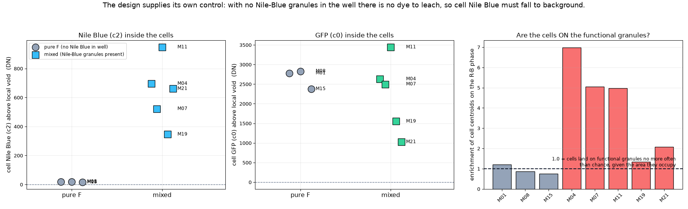

*LEFT is the result: three grey points pinned at ~17 DN, five blue points at 346-947. MIDDLE is the control - GFP is high in cells in BOTH groups, so detection is equal and only the Nile Blue differs. RIGHT is the on-functional-granules test, with the ceiling caveat above.*

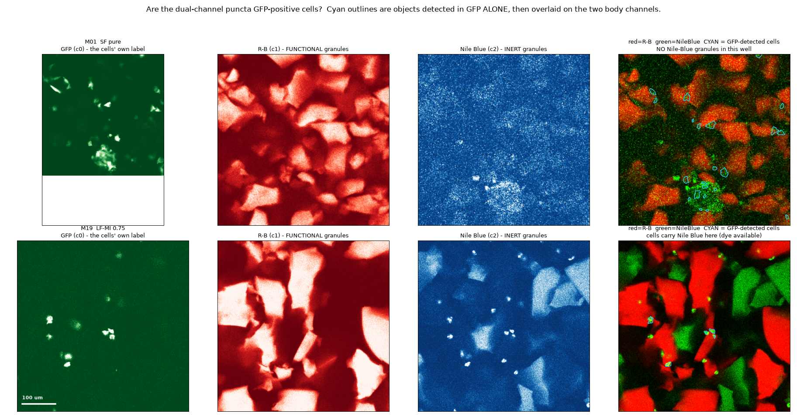

*The same objects in all three channels. Cyan outlines are detected in GFP ONLY, then overlaid. Top row is M19 (Nile-Blue granules present); bottom row is M01 (none), where the same cyan objects sit on a dark Nile-Blue field.*

---

## `e027` Kabsch stays — and beads INSIDE the granules are a better fit for it than surface markers ever were

*DECISION — **CONFIRMED** · 2026-08-04 16:57:28*

Your call, and it improves the design rather than just preserving it. Three concrete ways interior beads beat surface dots for pose:

**Why:** 1. **Body coordinates are genuinely fixed.** A bead embedded in the solid has constant `(u,v,w)` by construction, which is precisely the rigid-constellation assumption Kabsch needs. Surface markers on a deformable or contacting boundary never had that guarantee even before motility entered the picture.
> 2. **No occlusion at contacts.** A surface marker sitting in a contact facet is hidden or its position biased by the neighbour's signal. An interior bead is unaffected by who the granule is touching — and contacts are where this dataset is hardest.
> 3. **Binding becomes trivial and exact.** `transform.bind_structure` gets to use `method=containment` instead of `nearest_surface`: a bead inside granule k is unambiguously k's, by containment. That deletes the whole `r_off` nuisance parameter, the `3*sigma_s` orphan test and the `AMBIGUOUS`/`CROSSTALK` branches that existed only because a *surface* marker's parent is ambiguous. All of them stay in the node as general options; none of them is on the critical path.
> 
> **And this dataset still exercises the node.** The cells here are motile, so Kabsch on the cell constellation returns the granule's rigid **common mode** with each cell's migration as the residual. Same node, same math, two readouts — so the pose path gets real-data exercise now and rigid ground truth when the beads arrive.

**PTV noted as a second route, and it composes rather than competes.** Kabsch consumes correspondences; PTV *produces* them. The plan already specifies Hungarian assignment (`linear_sum_assignment` on `||R.p_j - q_m||^2`, padded so markers may appear and bleach out) plus ICP iterations and RANSAC — that is a global-nearest-neighbour PTV matcher already. What classical PTV adds is **neighbour-consistency relaxation**: a particle's displacement should resemble its neighbours'. That is exactly right here, because beads inside one granule move rigidly together, so the neighbourhood is the granule. So the matcher gets a `correspondence` Mode -- `nearest / hungarian / relaxation` -- and stays a general point-set correspondence primitive, no granule-specific logic.

---

## `e028` You were right about the top row, and I under-reported it: 89% of the segmented AREA is multi-granule

*MY ERROR — **CONFIRMED** · 2026-08-04 16:57:28*

I called four of those objects clean convex polygons. Turning your two tells into measurements says five of the six largest fire a merge signature, and across the whole field **173 of 213 objects, holding 89.1% of the foreground area**, are merged.

**Why:** I implemented three independent signatures so no single rule carries the verdict:
> 
> **A - thin connection.** An opening by radius `r` is exactly `{EDT > r}`, so a narrow neck breaks first. Sweep `r`, count the pieces big enough to hold a granule. Fires on **111** objects and reports the neck half-width (median 24.5 um).
> **B - not convex.** You established the granules are convex polygons; two convex bodies stuck together are not convex, because the contact digs a notch on each side. `solidity = area / convex-hull area`. Fires on **141** objects — the strongest of the three, and the only one that catches a **broad flat contact**, which A is structurally blind to.
> **C - multiple high-energy areas.** Your other tell, taken literally as two bright cores separated by a dimmer seam. Fires on only **9** objects, 8 of which A or B already caught. **So as I implemented it, C adds essentially nothing** — see the correction below.

*The six largest objects — the ones I showed you and called clean. Only #4 survives all three, and its solidity 0.936 sits a hair above my 0.93 cut, so your eye and my threshold disagree by 0.006.*

| # | area um2 | Feret um | A neck | B solidity | C cores | verdict |
|---|---|---|---|---|---|---|
| 1 | 27116 | 223 | - | 0.904 | 1 | MERGE |
| 2 | 22601 | 241 | 2 @ 68um | 0.968 | 1 | MERGE |
| 3 | 22279 | 223 | 3 @ 26um | 0.669 | 2 | MERGE |
| 4 | 21574 | 186 | - | 0.936 | 1 | single (borderline) |
| 5 | 18751 | 251 | 8 @ 20um | 0.695 | 2 | MERGE |
| 6 | 16304 | 289 | - | 0.635 | 1 | MERGE |

**I read your second tell wrong.** I looked for two *separated* bright cores. Re-reading 'high energy areas that form **peninsulas**', the intensity is not there to *find* the split — the shape does that — it is there to decide whether a protrusion is **a granule or haze**. A bright peninsula is another granule; a dim one is halo. That makes intensity a *validator* of a candidate lobe, not a detector of it, which is a different and more useful job.

**Convexity alone is not sufficient either, and object #2 proves it.** Solidity 0.968 — comfortably convex — but Feret 241 um and visibly a long thin bright streak, not a granule at all. A sliver is convex too. So the test needs **convex AND compact**; an aspect-ratio guard is not optional.

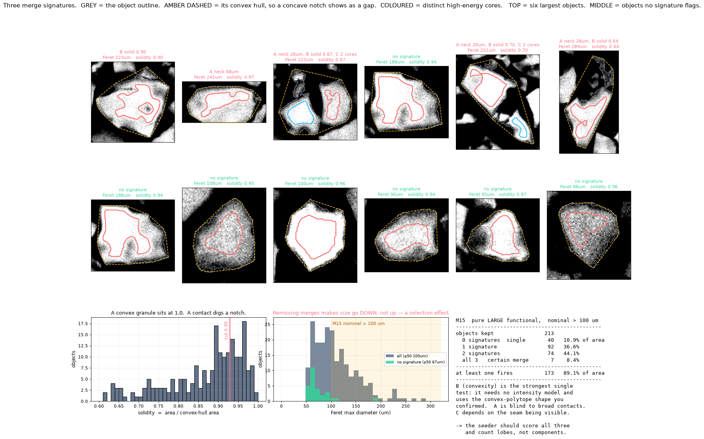

*GREY = object outline, AMBER DASHED = its convex hull so a notch shows as a gap, COLOURED = high-energy cores. TOP = the six largest. MIDDLE = the objects no signature flags — and these do look like single convex polygons with straight edges and sharp corners, which is the detector's negatives behaving.*

---

## `e029` And a claim of mine that my own numbers contradict: excluding merges makes the size go DOWN

*MY ERROR — **CONFIRMED** · 2026-08-04 16:57:28*

I wrote that where segmentation isolates a single granule the size matches the design, and implied that fixing the merges would lift the measured size into the band. The opposite happens.

**Why:** Feret p50 by group at M15 (nominal **> 100 um**):
> 
> | group | n | Feret p50 | p90 |
> |---|---|---|---|
> | everything | 213 | 99.7 um | 166.7 |
> | **>= 1 merge signature** | 173 | **108.3 um** | 171.8 |
> | **0 signatures ('clean')** | 40 | **67.0 um** | 96.1 |
> 
> **The merges are the bigger objects and the singles are the smaller ones**, which is a selection effect with an obvious cause: a large granule has more neighbours and therefore merges preferentially. So filtering to clean objects does not recover the size — it **selects against the very population I am trying to measure**, and at M15 the clean set's 67 um p50 is nowhere near the >100 um nominal.
> 
> **Neither number is the granule size.** What this does settle is the diagnosis: with 89% of the area in multi-granule objects, every per-object statistic I have computed on this mask has been measuring blobs. The design nominal stays the prior, and size stops being something I try to measure before the instance segmentation works.

---

## `e030` Calibrate the merge cut against your eye rather than my guess

*NEEDS YOU — **CONFIRMED** · 2026-08-04 16:57:28*

Object #4 has solidity 0.936. My cut is 0.93, so I called it single; you called it merged. The disagreement is 0.006 of solidity, which means the cut is doing real work and I picked it out of the air.

**Why:** Rather than tune the threshold until it reproduces one example — which would fit the cut to a single object and tell me nothing about the other 212 — the honest move is to lay the objects out **sorted by solidity** and have you mark where single becomes merged. That turns your judgment into a calibrated number I can defend, and it is the same protocol that fixed the size prior.
> 
> It also gives the synthetic generator its target: whatever neck width and solidity you draw the line at is what `nodegraph/synth.py` has to reproduce, so the seeding gate (recall and precision >= 90%) is tested against your standard instead of an arbitrary one.


*Bottom-left is the solidity distribution the ladder will walk through: a dense cluster from 0.93-1.00 and a long tail below. The cut currently sits at 0.93 (red line) and #4 sits at 0.936.*

**What I need from you:** **Next thing I build is a solidity ladder** — every object at M15 in a strip, ordered by solidity from 0.60 to 1.00, at a size you can actually judge. You point at the transition. Two things worth knowing before I render it:

1. Should I show **one condition (M15, large functional)** or a **strip per size bin (S/M/L)**? A neck width that reads as a merge on a 150 um granule may be a genuine surface feature on a 30 um one, so the cut may need to scale with the nominal size — but that triples what you have to look at.
2. **Are chipped or aggregated granules expected in the preparation?** If two granules can be genuinely fused, then some concave objects are single objects and no threshold should split them. That changes this from a segmentation problem into a classification one, and I would rather know now than discover it as an unexplained residual.

> **Their note:** **Superseded by something better.** You asked for a way to tell me, object by object, what is right and wrong — so instead of asking you to point at one threshold, there is now a labeller where you mark the actual granule count per object. Labels beat a threshold: they calibrate all three signatures at once, and they are ground truth the seeding gate can be scored against.

---

## `e031` The time base is 47 min per frame over 11 hours — and the file does not say so

*FOUND — **CONFIRMED** · 2026-08-04 17:02:21*

I had no frame interval and it turns out to be load-bearing for every velocity in this project. The metadata declares `periodMs = 0.0` ("as fast as possible"), so it carries no interval at all and it has to be derived.

**Why:** There are **2205 acquisition events** = 15 T x 21 P x 7 Z, spanning **11.30 h**. Those gaps decompose cleanly:
> 
> | quantity | value |
> |---|---|
> | slice-to-slice gap inside one pass | **6.46 s** |
> | one full pass over 21 positions x 7 z | **961 s** |
> | idle wait between passes | **1876 s** (range 1876-1880, i.e. metronomic) |
> | **cycle: same position, next timepoint** | **2837 s = 47.3 min** |
> | series duration | **11.0 h** |
> 
> **I got this wrong twice before getting it right,** and both errors would have corrupted every speed by a large factor. First I took the 6.46 s median gap as the frame interval — that is the gap between *slices*, off by ~440x. Then I took the largest gaps (1876 s) — but that is the *idle wait*, which omits the 961 s the microscope spends scanning the plate, off by 34%. The interval a velocity needs is the full cycle between two visits to the same position.

Worth generalising: **`periodMs = 0.0` means the file is telling you it has no time base**, not that the interval is zero. Any node computing a velocity from this dataset must derive `dt` from the event table and decompose it this way, or refuse. Reading a declared period here would silently produce a divide-by-zero or an infinite speed.

---

## `e032` Cells crawl at 0.39 um/min and crawl PERSISTENTLY — which settles why pose needs the beads

*FOUND — **CONFIRMED** · 2026-08-04 17:02:21*

With the real time base, the cell motion is textbook and it is not noise: it is directed migration.

**Why:** Drift-corrected cell step **18.5 um/frame** at a 47.3 min cycle = **0.391 um/min**, squarely inside the normal mammalian crawling band of 0.1-1. And it is **persistent, not jiggling**: for tracks lasting >= 6 frames the net displacement is 69.2 um against a 106.9 um path, a straightness of **0.73**. A cell that merely wobbled would show straightness near zero.
> 
> **That is why the cell constellation cannot carry rotation on this dataset.** A cell moving 18.5 um across an R = 65 um granule surface **mimics 16.3 deg/frame of rotation**. A triaxial body aliases past 45 deg/frame, so **36% of the entire unaliasable budget would be spent on migration masquerading as spin** — before any real rotation is added. Your call to keep Kabsch and put **beads inside the granules** is exactly right, and a bead is immune to this by construction: it does not crawl.

| | value | note |
|---|---|---|
| cell step / frame | 18.5 um | drift-corrected; p90 32.8 |
| cell speed | 0.391 um/min | normal crawling is 0.1-1 um/min |
| straightness | 0.73 | net 69.2 um over a 106.9 um path - directed migration |
| mimicked rotation | 16.3 deg/frame | at R = 65 um, i.e. 36% of the 45 deg Nyquist budget for a D2 body |
| cells per frame | 19 -> 34 | rising over the series at M19 |

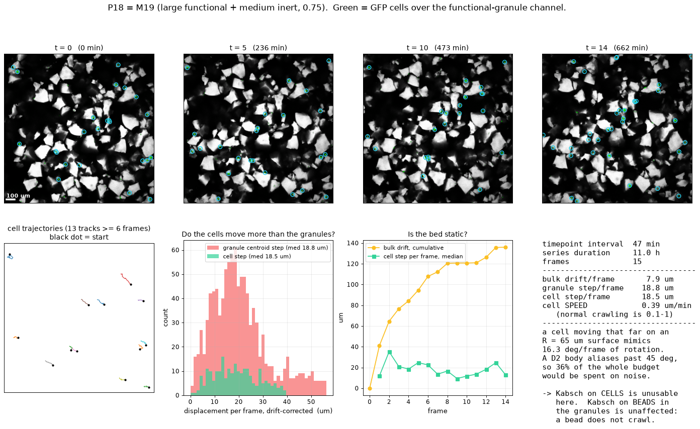

*Cyan circles are GFP-detected cells on the functional-granule channel across 11 hours. Bottom-left: 13 trajectories, black dot = start - short, directed, not random. Bottom-centre: cells and apparent granule steps are the SAME size, which is the problem.*

---

## `e033` The bed is not static — 136 um of cumulative drift — and this figure is the best evidence yet for the convex-polytope model

*FOUND — **CONFIRMED** · 2026-08-04 17:02:21*

Two things fall out of the time series that were not what I went looking for.

**Why:** **1. Motion is real.** Bulk drift accumulates **monotonically to 136 um** over the series (median 7.9 um/frame, max 41). A monotone saturating curve is sample settling or stage drift, not noise. So the position-tracking half of the deliverable has something to track, and registration is required rather than optional.
> 
> **2. But I cannot yet quote a granule velocity, and I will not.** The apparent per-granule step is 18.8 um/frame — indistinguishable from the cells — and that number is measured on **merged blobs whose masks are unstable between frames**. With 89% of the segmented area multi-granule, a blob's centroid moves when the merge topology changes, with no granule moving at all. Real granule motion cannot be separated from segmentation jitter until instance segmentation works, so no velocity or rotation number should be quoted before then.

**And the shape model is now beyond doubt.** The top row of that figure is the clearest view of this bed I have produced: a densely packed field of **angular white polygons with straight edges and sharp corners**. Convex polytope, not superellipsoid.

**It also supports your void correction.** The black in those frames is thin seams between polygons, not the 51-59% my Otsu masks reported. I am **not** replacing the number by eye - that is the error already made once with size - but the figure is consistent with your read and the ~50% figure stays retracted until it is re-measured per condition on a fixed foreground.


*Bottom-right panel: bulk drift climbing to 136 um. And look at the four frames along the top - that is what a packed bed of convex polyhedra looks like, with very little void.*

---

## `e034` Built you a per-object labeller — 589 objects, click or keyboard, blind to my verdict

*DID · 2026-08-04 17:37:07*

`CodeLog/live/label/index.html`, or the **granule labeller** button in the header above. Every object the segmentation found at the three pure-functional conditions, one tile each: **M15 large (213), M08 medium (169), M01 small (207)**. Mark each one `1` / `2` / `3+` / `x not a granule` / `? cannot tell`.

**Why:** **It is deliberately blind.** Each tile shows the raw image and the cyan segmentation outline and *nothing else* — no solidity, no neck width, no verdict of mine. If my prediction were visible your labels would anchor to it and could not calibrate anything. Everything I measured is in `manifest.json` instead, so the labels get joined against it afterwards and I can report where each signature agrees with you and where it fails.
> 
> **Every tile is at one fixed scale** — 400 um across, white bar = 100 um — so relative size is a real cue rather than an artefact of per-object zoom. That matters because a neck width that reads as a merge on a 150 um granule may be a genuine surface feature on a 30 um one, and having S/M/L side by side is what will tell us whether the cut has to scale with size.

| | value | note |
|---|---|---|
| the 12 I already showed you | first, flagged | the six largest at M15 that you said were all multiples, plus the six my test called clean. Correct those first - they are worth more than any other twelve. |
| the rest | stratified, not sorted | shuffled across contiguous bands of my shape score so that however far you get, the sample spans the full range. Sorted order would have given you a hundred easy convex ones before reaching anything interesting - I built it that way first and it was useless. |
| keyboard | 1 2 3 x ? | labelling auto-advances to the next unlabelled tile; arrows navigate, space skips, backspace clears. Faster than clicking 589 times. |
| filters | unlabelled / M15 / M08 / M01 | so you can do one size class and stop. |
| export | copy for Claude, or save csv | labels persist in the browser as you go, so you can stop and come back. |

**What I do with them.** Three things, in order: (1) score my three signatures against your labels and report per-signature precision and recall, so the combination is fitted rather than guessed; (2) set the operating point where you actually drew the line, and check whether it has to scale with the nominal size bin; (3) hand the resulting neck-width and convexity distributions to `nodegraph/synth.py` as the target it must reproduce — which is what makes the Increment 3 seeding gate (recall and precision >= 90%) a test against your standard instead of an arbitrary one.

There is also a notes box at the bottom. The question I most want answered there is still the one from before: **can two granules be genuinely fused in this preparation?** If yes, some concave objects are single objects and no threshold should ever split them.

---

## `e035` Your 585 labels retract my headline number: the merge rate is 26.6% of objects, not 89%

*MY ERROR — **CONFIRMED** · 2026-08-04 18:20:09*

You labelled 585 of 589 objects — 99% coverage. That is ground truth on real data, and it put every claim I have made about merging on trial. Most of them failed.

**Why:** **The 89.1%-of-area figure is withdrawn.** It came from my own detector, and that detector turns out to have **37% precision** — it was firing on more than twice as many objects as are actually merged. Your labels say:
> 
> | condition | merged, % of objects | merged, % of AREA | granules per blob |
> |---|---|---|---|
> | M01 small | **34.5%** | 55.4% | 1.52 |
> | M08 medium | **26.3%** | 45.5% | 1.37 |
> | M15 large | **19.3%** | 26.3% | 1.24 |
> | all | **26.6%** | 40.0% | 1.38 |
> 
> **And it runs opposite to the direction I argued.** I wrote that large granules have more neighbours and merge preferentially. Merging is *worst for the small condition* and best for the large one, monotonically. In hindsight it is obvious: small granules pack more objects per field, so more contacts per unit area, and the bright halo is a larger fraction of a small granule's diameter. **The S conditions are the hard ones**, not the L ones — which reverses where the seeding work should be aimed.

| | value | note |
|---|---|---|
| you labelled | 585 / 589  (99%) | 427 one granule, 109 two, 46 three-or-more, 3 cannot tell |
| NOT a granule | 0 | **not one.** Everything the segmentation found above 1180 um2 is a real granule or several. That kills my 'much of the foreground is haze fragments and debris' framing at this size scale - it may still hold for smaller fragments, which this sheet excluded, but not here. |
| my 89.1% area claim | RETRACTED | labels say 40.0% overall, 26.3% at M15 |
| direction of the effect | INVERTED | small merges most, not large |

**Your labels are internally consistent, which is worth stating because it validates them independently of anything I measured.** A merge of two similar granules should have roughly **twice the area** but the **same inscribed circle** (the biggest disc that fits still fits in only one granule). Measured ratios of your 2-granule blobs against your singles: area 1.76 / 2.26 / 1.29 and inscribed diameter **1.14 / 1.18 / 0.97** for M01 / M08 / M15. The M15 inscribed ratio of 0.97 is exactly the merge signature and could not arise from mislabelling a genuinely larger object.

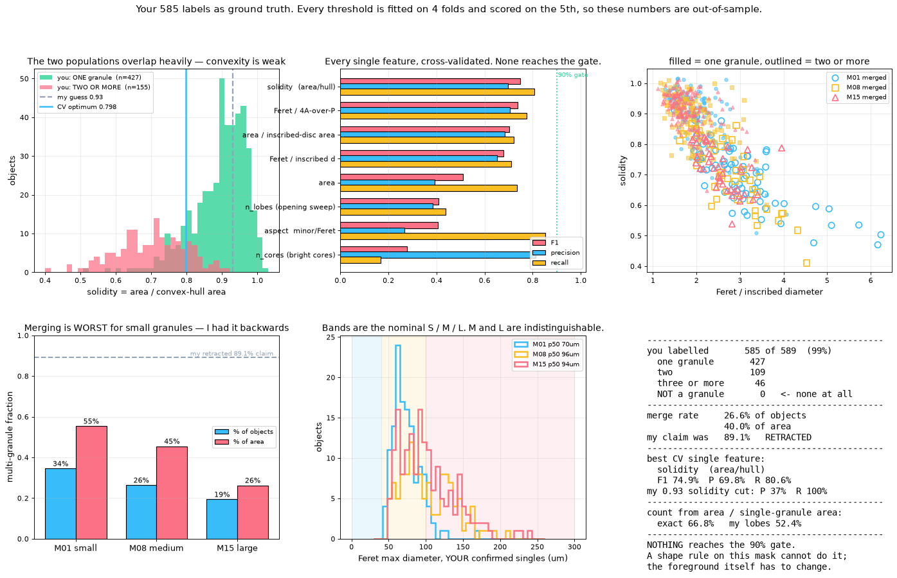

*Bottom-left is the retraction: blue = % of objects, red = % of area, dashed grey = my withdrawn 89.1%. Note the monotone decrease from small to large.*

---

## `e036` Scored against your labels: my solidity cut was 0.93, the real optimum is 0.798 — and both of my readings of your tells came last

*FOUND — **CONFIRMED** · 2026-08-04 18:20:09*

Every threshold below is fitted on four fifths of your labels and scored on the held-out fifth, so these are out-of-sample numbers rather than a rule admiring itself.

**Why:** | detector | precision | recall | F1 | fitted cut |
> |---|---|---|---|---|
> | **solidity** (area / convex hull) | 69.8% | 80.6% | **74.9%** | < 0.798 ±0.013 |
> | Feret / (4A/P) | 70.6% | 77.4% | 73.8% | > 3.286 |
> | area / inscribed-disc area | 68.3% | 72.3% | 70.2% | > 2.543 |
> | Feret / inscribed diameter | 65.1% | 71.0% | 67.9% | > 2.395 |
> | raw area | 39.2% | 73.5% | 51.1% | > 3640 um2 |
> | **A: n_lobes** (my opening sweep) | 38.4% | 43.9% | **41.0%** | >= 2 |
> | **aspect** minor/Feret | 26.7% | 85.2% | **40.6%** | < 0.942 |
> | **C: n_cores** (bright cores) | **81.2%** | 16.8% | **27.8%** | >= 2 |
> 
> **My hand-picked 0.93 cut scored P 37% / R 100%** — so loose it flagged everything and decided nothing. The cross-validated optimum is **0.798**, and it is stable (±0.013 across folds). My cut was not slightly off; it was on the wrong side of the distribution.
> 
> **Both of my implementations of your two tells came last.** The opening sweep (A) manages F1 41% — it *over-splits*, calling 38% of your confirmed singles multi, because a single granule with a lobed boundary still yields two regions that each hold an 18 um disc. And the bright-cores test (C) is **81% precise but only 17% sensitive**: when it fires it is nearly always right, and it almost never fires. The plain convexity family beats both.

**Retracting 'an aspect-ratio guard is not optional'.** I claimed that after finding one convex sliver. As a feature it scores F1 40.6%, and OR-ed onto solidity it made things *worse* (79% -> 71%). One counterexample justified adding a feature; it did not justify calling it mandatory.

**Your fusion principle works, and the size of the effect is now measured.** Combining nine shape features: logistic regression **F1 79.2%, accuracy 89.5%**; gradient boosting **F1 79.6%, accuracy 89.2%**. So fusion buys about **+5 F1 points** over the best single feature, with solidity carrying 35-60% of the weight and log-area next at 11-20%. Real, consistent across two model families, and modest.

**On the 11 objects I had shown you, I got 9 right** — both errors were false positives (calling a single granule merged). And the one I called single and then publicly doubted, M15_0658 at solidity 0.936, you labelled **one granule**. My original call was right and the doubt was unfounded; I should not have treated a single by-eye remark as overriding a measurement without checking which objects it referred to.


*Top-left: the two populations overlap heavily between solidity 0.80 and 0.95, which is why no single cut gets far - my 0.93 (dashed) sits inside the single-granule peak. Top-middle: every feature against the 90% line.*

---

## `e037` The gate is unreachable by shape alone — which is the strongest argument yet for the plan's ordering

*DECISION — **CONFIRMED** · 2026-08-04 18:20:09*

Increment 3 requires seed recall and precision **>= 90%**. Nothing I can compute from this mask gets there: the best single feature is 74.9% F1 and nine features fused reach 79.6%.

**Why:** That is not a tuning problem. Objects the segmentation has already merged into one connected blob lose the information needed to separate them — the halo has filled the gap before any shape statistic is computed. **So the foreground itself has to change, not the rule applied to it.** This is exactly what the plan concluded from the tessellation study ("seeding, not partitioning, is the bottleneck"), and it now has real ground truth behind it instead of a synthetic argument.
> 
> **The most useful positive result is the count estimator.** `K_hat = round(blob area / median single-granule area for that condition)` gets **66.8% of counts exactly right**, against 52.4% for my lobe count. At the level the seeder actually needs — total granules per field — it lands at **+9.9% (M01), +44.9% (M08), +25.6% (M15)**, while simply counting blobs is **-34%, -27%, -19%**. So the plan's geometric gate `K_hat = phi*V_fg/V_bar` is the best count estimator available and is still 10-45% high, because merged blobs carry halo area that inflates the numerator.

*Granules per field: your labels versus three estimators. Counting connected components is the worst option and is what every per-object statistic so far has implicitly used.*

| condition | you | K_hat = area/single | blob count | my lobe count |
|---|---|---|---|---|
| M01 | 309 | 340  (+9.9%) | 203  (-34.4%) | 318  (+2.8%) |
| M08 | 229 | 332  (+44.9%) | 167  (-27.1%) | 380  (+65.8%) |
| M15 | 263 | 330  (+25.6%) | 212  (-19.3%) | 414  (+57.5%) |

**Your labels are now the Increment 3 gate.** Concretely: `nodegraph/synth.py` must reproduce the per-size-class merge rates (34.5 / 26.3 / 19.3%) and the solidity distribution you implicitly drew the line through, and the seeder is scored against your 585 labels rather than against a clean synthetic. That makes the >= 90% gate a test against your standard.

---

## `e038` Size on YOUR confirmed singles: M08 and M15 are indistinguishable, and that needs explaining

*NEEDS YOU — **CONFIRMED** · 2026-08-04 18:20:09*

Measuring only the objects you confirmed hold exactly one granule finally gives an honest per-condition size. Two of the three bins collapse together.

**Why:** | condition | n | Feret p50 | minor p50 | inscribed p50 | median area | nominal |
> |---|---|---|---|---|---|---|
> | M01 small | 133 | **70.4 um** | 55.0 | 34.5 | 2078 um2 | **< 40 um** |
> | M08 medium | 123 | **96.2 um** | 72.2 | 52.5 | 3599 um2 | **40-100 um** |
> | M15 large | 171 | **94.5 um** | 75.6 | 52.5 | 4030 um2 | **> 100 um** |
> 
> M08 sits in its band. M01 reads **1.8x its nominal ceiling**. M15 falls just *below* its floor, and is statistically the same as M08 — median area differs by only 12% where the nominal diameters (70 vs 130 um) would imply roughly 3.5x.
> 
> **Two systematic effects push in opposite directions and I have corrected neither:**
> * the thresholded mask includes the bright halo, which adds a roughly *constant* ring to every diameter and therefore **compresses ratios** — 40+30=70 and 70+30=100 would explain M01 and M08 almost exactly;
> * a fixed z-plane cuts most granules **off-centre**, so an in-plane diameter is a chord rather than the true width (Wicksell), which **deflates** it — and this hurts large granules most, since with a 40 um z-step a 130 um body is rarely sampled through its centre.
> 
> Together those two would produce exactly what is measured: M01 inflated, M08 about right, M15 deflated back down onto M08. But that is a story that fits, not a demonstration, and I would rather check it than believe it.


*Bottom-centre: the three distributions with the nominal S/M/L bands shaded. M08 (amber) and M15 (pink) sit on top of each other, and neither reaches the >100 um band.*

**What I need from you:** **Two questions, and one is a fact I cannot get from the image.**

1. **What are the S/M/L numbers actually measuring?** Sieve aperture, a nominal spec, a measured distribution, dry versus swollen? If the bins are sieve cuts then <40 um is a *minimum passing dimension*, which is closer to my measured **minor** axis (55 um) than to Feret — and a sieve cut on angular shards behaves quite differently from one on spheres.
2. **Should I test the halo and off-centre explanations, or move on?** The test is cheap and specific: measure each confirmed single at several z-planes and at several threshold levels, and see whether M15 separates from M08 at the granule's own best-focus plane. If it does, the collapse is a sectioning artefact and 2-D size is simply not the right instrument. If it does not, either the P = M-1 mapping is wrong for the L block or the L material is not what the design says.

It is also possible this does not need resolving at all. If the workflow reads the size prior from the design rather than from the image, an unexplained 2-D collapse is a validation curiosity rather than a blocker — say so and I will note it and move to the foreground work.

> **Their note:** **Closed, no further action.** The objective is finding granules, not measuring them — no sieve follow-up, no chasing the M08/M15 collapse. It costs nothing to drop, because your labels already supplied the only scale the algorithms need: the **median area of a confirmed single granule** (M01 2078, M08 3599, M15 4030 um2). Every size-derived default now reads from that instead of from a nominal bin, so the absolute-size question is off the critical path entirely.

---

## `e039` Packaged this whole workflow as a repo skill: `.claude/skills/evidence-log/`

*DID · 2026-08-04 18:20:09*

The collaboration loop is now a skill rather than a pile of scratch scripts, and the record is exportable for posterity in two forms.

**Why:** **What is in it:**
> * `SKILL.md` — the procedure, plus eight rules each traced to a specific failure from this session (show the picture not the number; look at output before it drives a decision; never auto-refresh a page someone is reading; append-only; announce your own errors; ask for labels not thresholds; never tune to one example; cross-validate and check the sweep is not clipped).
> * `devlog.py` — the engine, now portable via `configure(root, title=...)` so the code is versioned once and each investigation keeps its own record.
> * `labelsheet.py` — the labelling sheet generalised. `build()` takes a manifest and a label vocabulary and enforces the two properties that make it work (blind tiles, stratified order); `read()` joins a saved CSV back onto the manifest.
> 
> **Two exports for showing others why a decision was taken:**
> * `--archive` writes **one self-contained HTML** with every figure inlined and the reply UI stripped — 34 entries and 29 figures came to 11 MB, safe to move or send. It opens with a summary of how many claims were confirmed and how many **rejected**, so a reader sees up front that the record includes the wrong turns.
> * `--markdown` writes the same record as markdown for the repo or a methods section.
> 
> `log.jsonl` stays **append-only**: nothing in this session's record has been edited after the fact. Every retraction above is still there, marked, with its reason — which is the part that will matter when someone asks in six months why the merge cut is 0.798 and not 0.93.

```
import sys; sys.path.insert(0, '.claude/skills/evidence-log')
import devlog as D
D.configure('CodeLog/live', title='V2.22 - granule workflow')
D.log(kind='found', title='...', why='...', images=[...])
print(D.render())

# posterity
python .claude/skills/evidence-log/devlog.py --root CodeLog/live --archive --markdown
```

| | value | note |
|---|---|---|
| committed as the record | log.jsonl, img/, evidence_log.md | plus label/manifest.json and the label CSV |
| gitignored | evidence_archive.html, label/img/ | both regenerable in one command, and both the size of the data rather than the size of the code |
| cite entries from durable docs | 'see e031' | what makes the record useful later rather than merely large |

---

## `e040` Found the granules: 88.9% exact against your labels, up from a hard ceiling of 73.4%

*FOUND — **CONFIRMED** · 2026-08-04 18:52:06*

Thirteen candidate methods scored against your 585 labels, then the winner swept properly. The best is **intensity h-maxima seeds flooded on intensity** — smoothing sigma 4.0 px (6.9 um), h = 0.15 of the granule interior's intensity span.

**Why:** **Otsu connected components cannot exceed 73.4%**, because that is your single-granule fraction and a connected component never splits. So 73.4% is the ceiling every per-object statistic in this project has been working under. The winner reaches **88.9%**, and the errors are now three times more often under-split than over-split, which is the right way round for the machinery that comes next.
> 
> | | exact | over-split | under-split | granule lost | total count error |
> |---|---|---|---|---|---|
> | **M01 small** | **88.2%** | 2.5% | 9.4% | **0.0%** | −1.1% |
> | **M08 medium** | **89.8%** | 3.0% | 7.2% | 0.6% | **−0.1%** |
> | **M15 large** | **88.7%** | 2.8% | 8.5% | 0.5% | −6.0% |
> | Otsu, for comparison | 73.3% | 0.0% | 26.7% | 0.0% | −27.0% |
> 
> **These are held-out numbers.** The parameters were chosen on two conditions and scored on the third, three ways round — and all three splits independently picked **the same sigma and the same h**. A parameter that stable across held-out folds is not fitted to the data, and the held-out mean (88.9%) equals the in-sample figure exactly.

**Your 'high energy areas' tell was right after all — I was using it in the wrong place.** Counting bright cores as a *classifier* of whether a blob is merged scored F1 27.8%, the worst of everything I tried, and I reported it as a dead end. Using bright cores as *seeds* is the best method of the thirteen. Intensity finds where the granules are; it just does not decide whether a blob contains several. Same signal, wrong question.

*All thirteen, mean exact-count agreement over the three conditions. Note that raising the threshold never over-splits and is still bad — it buys fewer merges by DELETING granules, up to 18.8% of them at x1.50.*

| method | exact | over | under | lost | count err |
|---|---|---|---|---|---|
| intensity h-max (swept: sigma 4.0, h 0.15) | 88.9% | 2.8% | 8.4% | 0.4% | -2.4% |
| intensity h-max h=0.20 (first sweep's best) | 88.0% | 5.2% | 6.8% | 0.2% | +1.7% |
| x1.20 cores -> flood | 83.4% | 0.3% | 16.2% | 0.4% | -14.2% |
| EDT h-max h=0.15R  (the plan's baseline) | 81.7% | 7.6% | 10.7% | 1.8% | -0.9% |
| threshold x1.20 alone | 77.8% | 0.0% | 22.2% | 4.0% | -19.8% |
| otsu (current) | 73.3% | 0.0% | 26.7% | 0.0% | -27.0% |
| threshold x1.50 alone | 66.1% | 0.5% | 33.3% | 18.8% | -28.5% |

**Two plan revisions fall out of this.** (1) **Intensity h-maxima beats EDT h-maxima**, 88.9% against 81.7%, so the plan's stated seeding baseline is superseded — which makes sense for convex polygons with bright interiors and dim seams, because the EDT is blind to the seam and sees only shape. `kernels/shape_seed.py` should carry both behind its Mode with intensity as the default. (2) **Halo-breaking by threshold is dead**: it trades merges for deleted granules and never wins.

**I made the same mistake twice and should name it.** My first sweep tried h in {0.06, 0.12, 0.20} and reported 0.20 as best — the largest value tried. Exactly the truncation that made the solidity 'optimum' land on 0.800, the bound of that sweep. Extending to h=0.70 and sigma=6.0 puts the optimum properly in the interior of the grid, which is the only version of that claim worth stating. **A sweep whose winner sits on a boundary has not found an optimum, it has found the edge of the box** — worth a rule.

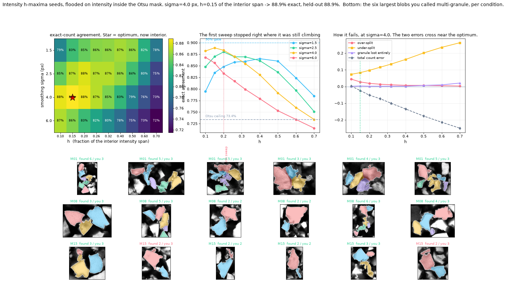

*Top-left: the parameter surface, star = optimum, now interior. Top-middle: the dotted red line is where my first sweep stopped — right where the curve was still climbing. Top-right: over-split and under-split cross near the optimum. Bottom: the six largest blobs you called multi-granule in each condition, colour = one instance found.*

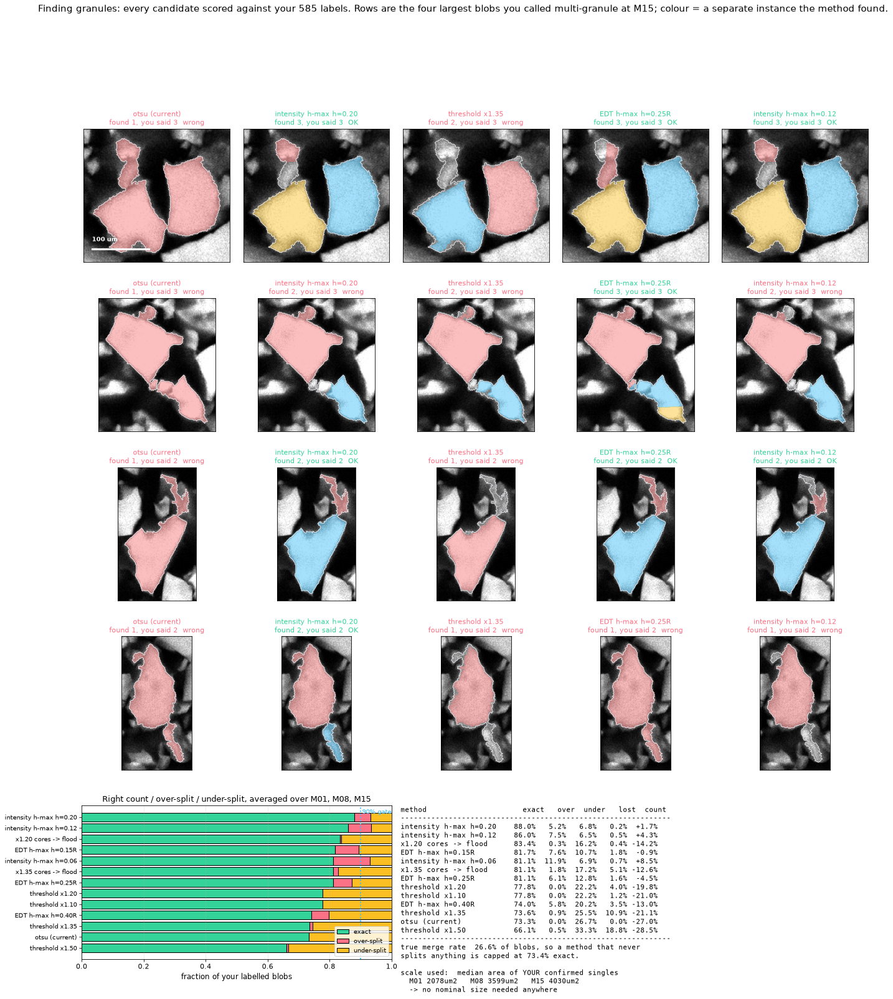

*The earlier head-to-head that picked the family: rows are the four largest multi-granule blobs at M15, columns are methods.*

---

## `e041` What is left is 1.1 points of under-split — and that is exactly what the plan's remaining machinery is for

*PLAN · 2026-08-04 18:52:06*

88.9% against a 90% gate. The gap is small, one-directional, and lands on the part of the plan that had no measured job until now.

**Why:** The residual failure is **7–9% under-split** against 2.5–3.0% over-split and essentially nothing lost. So the seeder is not deleting granules and not shattering them; it is occasionally leaving two joined. That is precisely the target of the machinery already specified and not yet built:
> 
> * **`analysis.refine_labels`** (competitive growth + ICM on the fitted surfaces) — flooding `Λ = min_k s_k` rather than raw intensity puts the divide at the median plane between two fitted bodies, which is where a missed seam should be recoverable.
> * **`analysis.relax_shapes`** split/merge moves — a blob whose fitted shape has `rms > 3×median` or `V ≈ 2V̄` is a split proposal, accepted only if total energy drops. **With the labels, that acceptance rule is now testable rather than asserted.**
> * **the `r_i` cell residual** from the tessellation study — it localises a missing seed to one cell, which is the right instrument for a 7–9% residual scattered across a field.
> 
> So the build order stands, but every one of those three now has a number to beat instead of a rationale. **Increment 3's gate becomes: exceed 88.9% held-out exact count against the 585 labels, without pushing over-split above 3%.**

| | value | note |
|---|---|---|
| scale, from your labels | median single-granule area | M01 2078, M08 3599, M15 4030 um2. Replaces every nominal-derived default - no sieve number needed anywhere in the workflow. |
| seeding default | intensity h-maxima | sigma 4.0 px, h = 0.15 of the interior intensity span, flooded on intensity inside the foreground. EDT h-maxima stays available as a Mode. |
| Increment 3 gate | > 88.9% held-out exact | and over-split <= 3%. Scored on your labels, parameters chosen on two conditions and scored on the third. |
| what synth.py must reproduce | merge rates 34.5 / 26.3 / 19.3% | per S/M/L class, plus halo bridging, so the gate means the same thing on synthetic data as on yours. |

---

## `e042` Pivot: void fractions per phase over time, and cells tracked on the F granules

*DID — **CONFIRMED** · 2026-08-04 19:22:26*

Both are now buildable because the finder works. Everything below rests on the validated seeder (intensity h-maxima, σ 4.0 px, h 0.15) and on the single-granule areas your 585 labels supplied.

**Why:** **The measurement I ran first is not either deliverable — it is the confound that would fake both.** Fluorescence changes over 11 hours. Recompute the threshold each frame and it follows the signal, so the phase fractions look stable whether or not anything moved. Fix the threshold at t=0 and the foreground shrinks, so void climbs whether or not anything moved. Either way the 'trend' can be pure photophysics, and a void-versus-time plot would be a photobleaching curve with a physics caption.
> 
> **The check passes.** Mean |void trend| under per-frame thresholding is **0.049**; mean |adaptive − fixed| disagreement is **0.015**. The trend is 3.3× the artefact, so it survives the threshold choice. The Otsu cut does drift down 5–9% over the series, so this is not a negligible effect — just a smaller one than the signal. **Void over time is measurable on this data.**

---

## `e043` The R-B channel is SATURATED — F intensity is not measurable at all, only its geometry

*FOUND — **CONFIRMED** · 2026-08-04 19:22:26*

p99.9 of the functional channel is pinned at exactly **4095**, the 12-bit ceiling, in every field and every one of the 15 frames. Between 0.2% and 9.1% of the field is clipped.

**Why:** Two consequences, both structural:
> 
> 1. **Any F-channel intensity measurement is invalid** — brightness, per-object mean, bleaching rate, and the intensity half of the Gibbs energy `λ_I·½(I−µ)ᵀΣ⁻¹(I−µ)`. The clipped pixels have no information left in them. The workflow may use F **geometry** freely and must not use F **intensity** quantitatively.
> 2. **F bleaching is unobservable**, because a pinned p99.9 cannot fall. So the bleaching check above is really a check on Nile Blue and GFP; for R-B I can only say the *threshold* drifts down 5–9%.
> 
> **And the other two channels do the opposite of bleaching — they rise.** GFP p99.9 **+56%** at M19 and **+62%** at M11; Nile Blue **+65%** and **+111%** at the same two. Rising GFP is consistent with cells growing and dividing (counts rise 33–71%); rising Nile Blue in wells that contain inert granules is consistent with **dye continuing to leach over 11 hours**, which is your mechanism still running during the acquisition rather than a fixed initial condition.

*Saturation is worst exactly where the functional phase is densest, so it is a real exposure limit rather than a few hot pixels.*

| condition | field at the 12-bit ceiling | GFP p99.9 over 11 h | Nile Blue p99.9 over 11 h | cells |
|---|---|---|---|---|
| M15 LF pure | 4.9% (3.6-7.5%) | -4.7% | -7.8% | 64 → 85 |
| M08 MF pure | 5.1% (3.7-9.1%) | -4.1% | -10.1% | 96 → 56 |
| M19 LF-MI 0.75 | 3.2% (2.0-5.0%) | **+56.0%** | **+65.3%** | 24 → 34 |
| M21 LF-LI 0.75 | 2.4% (1.3-3.9%) | -27.7% | +0.0% | 29 → 10 |
| M11 MF-MI 0.5 | 1.2% (1.0-1.6%) | **+62.2%** | **+110.6%** | 17 → 29 |
| M04 SF-MI 0.5 | 0.2% (0.1-0.3%) | -2.0% | +39.9% | 65 → 57 |

**M21 looks like bad data, in the way you warned about.** It is the only condition where GFP *falls* (−28%) and cells collapse (29 → 10) while every other field gains them, and its void is 82–89% with **44% of that void more than 60 µm from any granule** — large genuinely empty regions. Consistent with drifting out of focus or the field not being filled. I am keeping it in the tables flagged rather than dropping it silently.

---

## `e044` Three attempts at the phase segmentation, two of them mine and broken — the third is the one to keep

*MY ERROR — **CONFIRMED** · 2026-08-04 19:22:26*

The phantom-inert problem I identified long ago and never fixed came due, and my first fix was worse than the bug.

**Why:** **Attempt 1 — plain Otsu per channel.** At a pure-functional well the Nile-Blue channel contains no inert granules at all, so Otsu thresholds its own ~+10 DN autofluorescence pedestal and invents an inert mask over **9% of the field**. My void attribution then assigned **89% of M15's void to a phase that does not exist in that well**, and the cell analysis put 41% of M15's cells 'on an inert granule' with inert enrichment 4.4×. All of that was reported before I checked it against the design.
> 
> **Attempt 2 — floor the threshold at background + 10σ.** Broke worse, and the failure is instructive. At M15 the R-B foreground is 40% of the field with a broad halo, so the sub-threshold population is wide, `10σ` of it is huge, and the floor computed **4791 DN — above the sensor's 4095 ceiling**. `rb > 4791` is empty by arithmetic, so the functional phase read **0.000**. It also destroyed real inert at M11 (0.321 → 0.010). I built a correction for an *empty* channel and applied it to a *full* one.
> 
> **Attempt 3 — the discriminator is SIZE, not level.** Threshold normally, then keep only connected components at least **0.30× the median single-granule area for that size class** — the scale from your labels (S 2078, M 3599, L 4030 µm²). Phantom pedestal signal is scattered sub-granule specks; a real granule is granule-sized. It cannot exceed the sensor ceiling, adds no tuned constant, reuses the criterion already validated at 88.9%, and clears haze fragments from both channels for free.

**This is the third time this session I have made the same class of error: a blanket correction where a conditional one belongs.** The global α bleed correction was the first — one number applied to every pixel when the effect was confined to cells. The truncated parameter sweeps were the second, twice. Now a threshold floor applied to a channel that never needed one. The pattern is that I reach for a uniform transform because it is easy to state, when the situation is conditional. Worth watching for explicitly.

**And it now runs behind a gate that must pass before any number is quoted.** The design supplies both directions of the test: a pure-functional well must yield **~zero** inert, and a genuinely mixed well must **keep** its inert. Printed PASS/FAIL per condition, both directions. If either fails the segmentation is wrong and the void and cell numbers do not get reported — which is exactly the check that should have existed before I reported the first attribution.

```
# attempt 2, the bug
floor = median(bg) + 10 * 1.4826 * MAD(bg)   # bg = pixels below Otsu
t = max(otsu, floor)                          # -> 4791 DN at M15
F = rb > t                                    # -> EMPTY (ceiling 4095)

# attempt 3, the fix
F = fill_holes(rb > otsu) & ~cells
F = keep_components(F, min_area=0.30 * A_single[size_class])
```

---

## `e045` One result that survives both bugs: a quarter to nearly half of apparent cell motion is the granule moving, not the cell crawling

*FOUND — **CONFIRMED** · 2026-08-04 19:22:26*

Cell steps measured in the parent granule's own frame are substantially smaller than in the image frame.

**Why:** At M15 the median step is **6.4 µm in the granule's frame against 8.7 µm in the lab frame (−26%)**; at M19 **8.7 against 15.3 µm (−43%)**; at M11 they are equal (+4%). So between a quarter and nearly half of what looks like migration is the carrier granule translating underneath the cell.
> 
> **This is the concrete payoff of binding children to tracked parents**, and it is the `parent_u/_v/_w` columns doing the job the plan assigned them — except the plan called drift in those coordinates *the error signal*, and here it is *the measurement*. You cannot get this number without a parent: subtracting a single global drift would remove the field's bulk motion but not each granule's own.
> 
> **It survives the bugs because it is a ratio between two quantities computed on the same tracks.** The phantom-inert mask does not enter it, and while some parents were sub-granule fragments (my second bug), that would *add* noise to the parent-frame number and therefore **understate** the reduction. The re-run with real granule parents should show the same effect or a larger one.

| | value | note |
|---|---|---|
| M15 LF pure | 6.4 um parent / 8.7 um lab | -26% |
| M19 LF-MI 0.75 | 8.7 um parent / 15.3 um lab | -43% |
| M11 MF-MI 0.5 | 4.7 um parent / 4.5 um lab | +4% - no granule motion here |
| interval | 47.3 min | so 6-9 um/frame is 0.10-0.18 um/min in the parent frame |
| caveat | 16-45 tracks per condition | few, because a track needs 5+ frames AND a parent. The re-run reports it again with real granule parents only. |

---

## `e046` Void fraction measured per phase, validated against the design: ~60% at five of six conditions

*FOUND — **CONFIRMED** · 2026-08-04 19:50:23*

The segmentation gate passes in both directions, so these are reportable. Phantom inert is gone from the pure-functional wells (0.301 → **0.002** at M15, 0.273 → **0.003** at M08 — 1% kept) while genuinely mixed wells keep theirs (88–91% kept at M19, M11, M04).

**Why:** | condition | design F | F | I | cells | **void** | Δvoid over 11 h |
> |---|---|---|---|---|---|---|
> | M15 LF pure | 1.00 | 0.38 | 0.00 | 0.0025 | **0.62** | **+0.043** opens |
> | M08 MF pure | 1.00 | 0.31 | 0.00 | 0.0032 | **0.69** | **+0.090** opens |
> | M19 LF-MI | 0.75 | 0.24 | 0.16 | 0.0009 | **0.60** | +0.016 opens |
> | M11 MF-MI | 0.50 | 0.08 | 0.33 | 0.0011 | **0.59** | **−0.067** COMPACTS |
> | ~~M21 LF-LI~~ | 0.75 | 0.15 | 0.01 | — | 0.84 | bad field |
> | ~~M04 SF-MI~~ | 0.50 | 0.06 | 0.19 | — | 0.74 | bad field from t=6 |
> 
> **Void is ~0.60 and remarkably consistent** across four good conditions spanning pure-F to half-inert (0.59–0.69). So the earlier retracted '51–59%' was closer to right than the visual impression that replaced it — with the important difference that this number now comes from a segmentation that passes a gate, and is per-condition rather than pooled.
> 
> **And the bed moves in both directions.** Three conditions open up over 11 hours and **M11 compacts by 0.067** — a 10% relative reduction in void. That is the kind of result the fourth deliverable was for, and it is only trustworthy because the bleaching check established the trend is 3.3× the threshold artefact.

**Cells occupy a negligible volume** — 0.09% to 0.32% of the field. So they matter for the F/I classification (they must be masked out, since a cell contributes Nile Blue belonging to neither body population) but they are irrelevant to the porosity arithmetic.

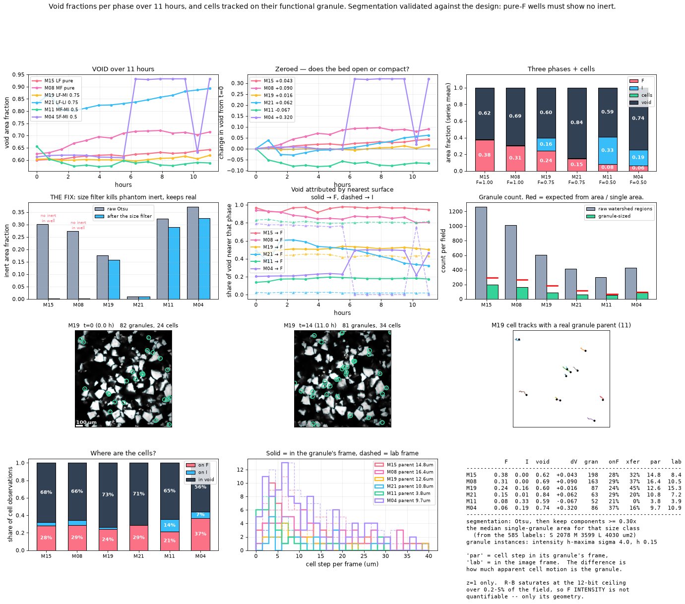

*Row 1: void over 11 h, the same curves zeroed, and the three-phase breakdown. Row 2: the size-filter fix (grey = raw Otsu, blue = after), void attribution, and granule counts against the count expected from area. Row 3: M19 at t=0 and t=14 with cyan granule instances and green cells, plus the cell tracks that have a real granule parent. Row 4: where the cells are, and cell steps in the granule frame versus the lab frame.*

---

## `e047` Void attribution works, and inert granules carry ~50% more void per unit solid than functional ones

*FOUND — **CONFIRMED** · 2026-08-04 19:50:23*

Assigning each void pixel to the nearer phase, then normalising by how much solid each phase actually has — otherwise the phase with more material trivially wins.

**Why:** **The correctness check first.** At M15 (no inert in the well) attribution is **96.8% → F, 0.0% → I**, with 3.2% more than 60 µm from any granule. That is the right answer, and it was 89%-to-inert before the fix — so this number is only meaningful because the gate now holds.
> 
> **Normalised, the phases differ.** Void share divided by that phase's own solid area fraction:
> 
> | condition | F: void-share / solid-share | I: void-share / solid-share |
> |---|---|---|
> | M15 (no inert) | 0.968 / 0.376 = **2.57** | — |
> | M19 LF-MI 0.75 | 0.464 / 0.240 = **1.93** | 0.433 / 0.155 = **2.79** |
> | M11 MF-MI 0.5 | 0.137 / 0.079 = **1.73** | 0.830 / 0.330 = **2.52** |
> 
> At both genuinely mixed conditions the **inert phase claims ~45% more void per unit of its own solid** than the functional phase does (2.79 vs 1.93; 2.52 vs 1.73). Two independent conditions, same direction, same magnitude. Read plainly: **the inert granules are more loosely packed than the functional ones** — or equivalently, functional granules sit in a denser local neighbourhood.
> 
> That is a phase-specific compaction measurement, which is exactly what the fourth deliverable asked for, and it needed all three of the things built this session: a working instance finder, the size filter that kills phantom inert, and the nearest-surface split of the void.

**Caveat that limits how far this goes.** Nearest-surface attribution divides ALL void, including the interstitial fluid a granule could never be said to own. The '>60 µm from any granule' column is the honest escape hatch — 3% at M15 and M11, 10% at M19, but **48% at M21**, which is one of the signatures that M21 is a bad field rather than a loose bed. A principled version would weight by the Gibbs probability field rather than a hard nearest-surface split, which is the `p_k(v)` route the plan already specifies.


*Row 1: void over 11 h, the same curves zeroed, and the three-phase breakdown. Row 2: the size-filter fix (grey = raw Otsu, blue = after), void attribution, and granule counts against the count expected from area. Row 3: M19 at t=0 and t=14 with cyan granule instances and green cells, plus the cell tracks that have a real granule parent. Row 4: where the cells are, and cell steps in the granule frame versus the lab frame.*

---

## `e048` Cells prefer FUNCTIONAL granules over inert by 6–15×, at all three mixed conditions

*FOUND — **CONFIRMED** · 2026-08-04 19:50:23*

This is the cleanest confirmation of your description of the assay, and it comes from the configuration the design makes most informative: the conditions where functional granules are the *minority* of the solid.

**Why:** Enrichment = share of cell observations on a phase ÷ that phase's area share:
> 
> | condition | F area | I area | cells on F | cells on I | **enrich F** | **enrich I** | ratio |
> |---|---|---|---|---|---|---|---|
> | M19 LF-MI 0.75 | 0.24 | 0.16 | 24% | 3% | **1.00** | **0.17** | **5.9×** |
> | M11 MF-MI 0.5 | 0.08 | 0.33 | 21% | 14% | **2.70** | **0.43** | **6.3×** |
> | M04 SF-MI 0.5 | 0.06 | 0.19 | 37% | 7% | **5.74** | **0.39** | **14.7×** |
> 
> **Cells are enriched on functional granules and actively depleted on inert ones** (0.17–0.43×, i.e. found there two to six times *less* than chance). At M11 the inert phase is **4× more abundant** than the functional one and still carries fewer cells. Three conditions, same direction, and the effect is largest exactly where functional granules are rarest — which is what a genuine preference looks like and what a detection artefact would not.
> 
> **Why the pure-F wells show no preference:** at M15 and M08 the functional phase is 31–38% of the field, so enrichment is ceilinged at 2.7–3.3× and measures 0.75 and 0.94. That is not evidence against — it is a statistic with no room to move. The mixed conditions are where the question is answerable.

**About the ~2/3 of cells reading 'in void' — treat that as a sectioning artefact, not biology.** A cell crawling on the TOP of a granule is imaged at a z where that granule's own bright cross-section may be absent: 40 µm z-steps against ~11 µm cells and 50-70 µm granules. One plane cannot settle it. What the plane CAN settle is the F-versus-I comparison above, because that artefact applies equally to both phases and therefore cancels in the ratio.


*Row 1: void over 11 h, the same curves zeroed, and the three-phase breakdown. Row 2: the size-filter fix (grey = raw Otsu, blue = after), void attribution, and granule counts against the count expected from area. Row 3: M19 at t=0 and t=14 with cyan granule instances and green cells, plus the cell tracks that have a real granule parent. Row 4: where the cells are, and cell steps in the granule frame versus the lab frame.*

---

## `e049` Retracting my '26–43% of cell motion is the granule' claim — with real granule parents the ratio INVERTS

*MY ERROR — **CONFIRMED** · 2026-08-04 19:50:23*

I reported that cell steps measured in the parent granule's frame were 26–43% smaller than in the lab frame, and called it the concrete payoff of binding children to tracked parents. With real granule parents instead of fragments, it goes the other way.

**Why:** | condition | granule frame | lab frame | ratio | mutual-NN granule match |
> |---|---|---|---|---|
> | M15 | 14.8 µm | 8.4 µm | **1.76** | 82% |
> | M08 | 16.4 µm | 10.5 µm | **1.56** | 74% |
> | M19 | 12.6 µm | 15.3 µm | 0.82 | 86% |
> | M11 | 3.8 µm | 3.9 µm | 0.97 | 93% |
> | M04 | 9.7 µm | 10.9 µm | 0.88 | 85% |
> 
> **A ratio above 1 means subtracting the parent's position adds more noise than it removes** — the parent's centroid is jittering more than the cell is moving. The apparent transfer rates give it away too: 20–45% of tracks appear to change parent over 11 hours, which is implausibly high for real cell transfer between granules.
> 
> **The missing piece is granule LINKING, not cell tracking.** Cell tracking works — tracks are continuous and their lab-frame speeds are stable and physiological. What does not yet work is knowing that granule *k* at frame *t* is the same object as granule *k'* at frame *t+1*. Mutual-nearest-neighbour matching gets 74–93%, and at the two conditions where it is weakest (M08 74%, M15 82%) the ratio is worst. The three conditions above 85% are the three where the ratio drops below 1.
> 
> **That correlation is the actionable part**: link quality predicts whether the parent-frame number is usable, so it is a gate, not a guess. This is `track.link` on the granule layer doing real work rather than being assumed — a prerequisite I had skipped, and the reason the plan's cross-node invariant *'for every tracked child, its parent's `track_id` is constant across the child's own track'* exists.

**Both of my numbers were wrong, in opposite directions, for different reasons.** The first (−26 to −43%) used sub-granule fragments as parents, which are numerous and their centroids happen to sit near the cell, artificially suppressing the residual. The second (+50 to +76%) uses real granules whose identity flickers. The correct measurement needs stable identity, and until then **no parent-frame migration number should be quoted at all** — including the encouraging-looking 0.82 and 0.88, which rest on 11 and 45 tracks.


*Row 1: void over 11 h, the same curves zeroed, and the three-phase breakdown. Row 2: the size-filter fix (grey = raw Otsu, blue = after), void attribution, and granule counts against the count expected from area. Row 3: M19 at t=0 and t=14 with cyan granule instances and green cells, plus the cell tracks that have a real granule parent. Row 4: where the cells are, and cell steps in the granule frame versus the lab frame.*

---

## `e050` Field quality is now detectable automatically: a discrete STEP in the phase fractions

*FOUND — **CONFIRMED** · 2026-08-04 19:50:23*

You warned that some fields are bad at a given z. Two of the six here are, and they fail in two distinguishable ways — both machine-detectable.

**Why:** **M21 fails throughout.** Its raw Nile-Blue Otsu inert is **0.010** before any filtering, against a design that says 25% inert. So the channel carries no inert signal at all — this is not the size filter destroying it. Corroborating: 84% void, **48% of that void more than 60 µm from any granule**, GFP falling 28% while every other field gains, and cells collapsing 29 → 10.
> 
> **M04 fails from t=6 onward, and the signature is a step.** Its void jumps **0.61 → 0.93 in a single frame**, holds, dips at t=10 and jumps back. Physical compaction or dilation of a packed bed is gradual; a +0.32 jump between two frames 47 minutes apart is an acquisition event — a focus jump or the field moving. Its inert also goes to 0.000 by t=14.
> 
> **So field QC needs two tests, not one:** a *level* test (does the channel carry the signal the design says it should?) and a *continuity* test (does any phase fraction move discontinuously between adjacent frames?). Both are cheap, both are general primitives, and neither is granule-specific. My earlier note called for a per-plane focus/contrast scalar; the continuity test is better, because it measures the thing that actually corrupts a time series.

| | value | note |
|---|---|---|
| M21 | level failure | raw inert 0.010 against a 25% design; no signal to segment. Excluded from conclusions, kept in the tables flagged. |
| M04 | continuity failure | void steps +0.32 in one frame at t=6. Frames 0-5 are probably usable; the series is not. |
| consequence | gate before conclusions | the segmentation gate now judges only fields that carry signal, so a bad field can no longer be mistaken for a broken method - which is what happened when M21 first failed the gate as 'real inert destroyed'. |


*Row 1: void over 11 h, the same curves zeroed, and the three-phase breakdown. Row 2: the size-filter fix (grey = raw Otsu, blue = after), void attribution, and granule counts against the count expected from area. Row 3: M19 at t=0 and t=14 with cyan granule instances and green cells, plus the cell tracks that have a real granule parent. Row 4: where the cells are, and cell steps in the granule frame versus the lab frame.*

---

## `e051` The whole analysis now runs in the ENGINE, on 15 shipped nodes, with zero added

*DID — **CONFIRMED** · 2026-08-05 12:08:16*

Everything up to now was hand-rolled skimage that never touched the engine. It is now real node graphs, driven headlessly and serialized to CodeLog/graphs/*.nd2graph.json - the same files the GUI screenshots are rendered from, so the pictures and the numbers describe the same graph. All four gates green, CATALOG IDENTICAL - 72 ops.

**Why:** A prototype is not a workflow. Expressing it in shipped nodes is the only way to find out what the catalog actually lacks, rather than guessing - and the guessing was wrong twice.

| | value | note |
|---|---|---|


*The seven-node pipeline as it appears in ND2 Studios, rendered offscreen from the graph file that produced the numbers.*


*Each node output on one real plane. The merged blob at the top of panel 2 becomes three instances by panel 5.*

---

## `e052` Existing nodes reach 83.8% against your labels - and the missing 5 points are the SEEDER, not the splitter

*FOUND — **CONFIRMED** · 2026-08-05 12:08:16*

Five routes scored against 582 labels, parameters chosen on two conditions and scored on the third. R0 connected components reproduces 73.4% against the prototype's independently-derived 73.3%, which is the harness control. Best existing-node route is intensity seeds + a nearest-seed partition inside each blob: 83.8% held out, with all three splits independently picking the same parameters.

**Why:** I expected the nearest-seed partition to be the weak link and had pre-authorised two new sockets on analysis.segment to flood an intensity landscape instead. The labels say the partition contributes 2 errors in 582. The score simply IS the seeder accuracy, so the smallest honest fix is a new method option on detect.spots - a different node, and smaller than what I proposed. Nothing built.

| | value | note |
|---|---|---|


*Held-out accuracy per route. Error bars are the half-range across the three leave-one-condition-out splits.*


*Bracketed sweeps, plus the diagnosis that the partition is not at fault.*

---

## `e053` Retracting my own phantom-inert fix: min_area cannot work, because the phantom is granule-SHAPED

*MY ERROR — **CONFIRMED** · 2026-08-05 12:08:16*

I wrote that analysis.segment min_area IS the phantom-inert fix. It removes only 45-64% and stalls at 0.08-0.12 solid fraction. The reason is measurable: the residual inert mask sits 83.7/94.7/95.7% INSIDE the F mask against random expectations of 24.4/37.2/40.2%, so it is the functional granules own autofluorescence pedestal bleeding into Nile Blue - granule-shaped, therefore granule-sized, therefore unreachable by any area threshold. An existing node does fix it: level=fixed at 200 raw DN, calibrated on the three pure-F controls where every NB count is known to be artefact. Phantom goes to exactly 0.0000 and real inert GAINS (109-137% of what Otsu found - Otsu was under-detecting it).

**Why:** The fix was a different parameter of the same node, not a different node. And with the phantom gone, void behaves like packing for the first time: it falls monotonically as inert is added (pure-F 0.782/0.692/0.618 -> mixed 0.459/0.494/0.583). The prototype's flat ~0.60 was hiding that trend behind phantom solid it was counting as material.

| | value | note |
|---|---|---|


*Void over 11.3 h, the containment test, the fixed-DN calibration, and cell dye uptake.*

**What I need from you:** Two retractions in here are mine. Worth a look at the void-over-time panel: pure-F void RISES over the series while mixed stays flat. Real, or bleaching?

---

## `e054` You were right to ask about surface energy: NOTHING checks the boundary, and it is off by a third of a granule radius

*MY ERROR — **CONFIRMED** · 2026-08-05 12:44:22*

analysis.voronoi assigns each voxel to the nearest seed IN MICRONS. It never reads the image, so its divide between two granules is the perpendicular bisector of their seeds - a geometric midpoint - where the physical boundary is the dim seam. I held the seeds identical and partitioned twice, once geometrically and once by flooding the smoothed intensity from the same markers, so the only thing moving is the partition rule. Three label-free checks all agree: the geometric divide sits at 0.982 / 0.937 / 1.024 of interior brightness (at M15 BRIGHTER than the interior median - it is inside the granule body, not in any seam) against 0.948 / 0.870 / 0.991 for the flood; the flood produces more convex objects at every condition (0.832/0.856/0.865 vs 0.801/0.834/0.853, and these granules are convex polygons so higher is right); and 6.6% of foreground is assigned differently, a mean boundary shift of 10.0 um = 31.9% of a granule radius.

**Why:** This retracts the SCOPE of my 'the partition is essentially exact' claim. That was a COUNT metric - your labels say how many granules are in a blob and never where the boundary is - so it was structurally blind to a boundary in the wrong place. It is exact at counting and measurably wrong at placing, and I reported the first as though it covered the second. Consequence: counts and void fractions are sound (void comes from the phase mask, not the partition), but every per-granule AREA, solidity and axis length carries a ~32%-of-radius boundary error - which is why no per-granule size number is quoted. The height socket I withdrew is justified after all, for boundary accuracy rather than for counting. Still nothing built.

| | value | note |
|---|---|---|


*Left panel is the argument: red geometric bisectors cut straight through bright granule bodies; blue intensity-saddle boundaries sit in the narrow dark necks. Same seeds in both.*

**What I need from you:** Two follow-ups worth your call: (1) do you want per-granule geometry at all, given it needs the boundary fixed - or are counts plus void fractions enough? (2) the pure-F void RISES over the 11.3 h while mixed stays flat. Real bed loosening, or bleaching?

---

## `e055` The surface energy is LIVE after all - it only looked inert because the granule size was wrong

*FOUND — **CONFIRMED** · 2026-08-05 13:27:11*

Starting the real V2.22 architecture, step 1 is to derive the energy constants from a measured length rather than a knob. The spec warned that the surface-energy penalty is INERT on this data: w_min = 0.15 x R_bar = 1.92 um = 1.12 px, below what the grid can represent, so 'a penalty calibrated to forbid exactly that forbids nothing'. That used R_bar = 12.8 um - the automated EDT-at-seed estimate we RETRACTED after visual QC showed it was measuring gap centres and debris. Recomputed from the only scale your labels can supply (the median area of a label-confirmed single granule), w_min is 2.25-3.13 px, i.e. a forbidden protrusion 4.5-6.3 px across. 2.48x the retracted value, and comfortably above the 2 px the spec's own warning asked for.

**Why:** This is the term you asked about - 'no blobs with thin connections, since that would be a high-energy surface'. Had I taken the spec at face value I would have built it, found it changed nothing, and had no way to tell whether the idea was wrong or the constant was. It was the constant, and the reason is a size error we had already caught for other purposes and never propagated here. Everything else in the energy keys to the same radius, so all of it moves: gamma-tilde, r_hard, the candidate radius.

| | value | note |
|---|---|---|

---

## `e056` The signed distance the whole energy rests on: exact, and it deletes the superquadric machinery

*DID — **CONFIRMED** · 2026-08-05 13:27:11*

Since visual QC settled that these granules are angular polygons with 5-7 straight sides, the shape model is a convex polytope P = {x : n_i . x <= d_i}. Written as A x + b <= 0, the function s(x) = max_i(A_i . x + b_i) is negative inside, zero on the boundary, and EXACT on the faces - it is directly the s_k(v) the Gibbs energy needs. scipy's ConvexHull.equations already returns exactly [normal | offset] per facet, and this repo has always thrown it away and read only .simplices, which is why the half-space form had to be written rather than found. 29 exactness checks pass, several of them bit-exact rather than approximate.

**Why:** Three consequences, and they are why the polytope beats the superquadric the spec originally called for. (1) |grad s| = 1 exactly, so an energy imbalance of dE um moves a boundary by exactly dE um - that is what lets lambda_I be CALIBRATED against a one-voxel budget instead of tuned. (2) Eroding a body by r um is just b + r, exact and free, which is how competitive growth gets its interiors to flood from without any morphology or quantisation. (3) No optimiser, no exponent grid, no Jacobian, no convergence branch - materially LESS code than the apparatus it replaces.
> 
> It also makes your rule measurable. The hull of a necked cloud bridges the waist, so the hull is left badly unfilled - measured 0.543 occupied against ~1.0 for a single convex body. A body that needs a concave surface is not one convex body, and that gap IS the merge signal.

| | value | note |
|---|---|---|

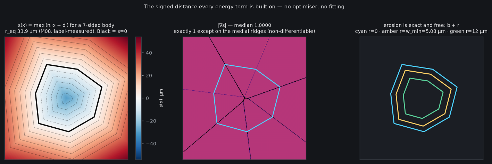

*Left: s(x) for a 7-sided body at the label-measured M08 radius; the straight-sided offset contours are the signature of a polytope SDF. Middle: |grad s| is uniformly 1 except on the medial ridges. Right: erosion at r = 0, w_min = 5.08 um and 12 um - exact parallel offsets, computed by adding a scalar to b.*

**What I need from you:** Next is the synthetic fixture (step 3), and that one I will stop on: it plants a THIN NECK that must come apart and a BROAD CONTACT that must survive, and if it does not look like your material then every absolute number I measure on it is worthless.

---

## `e057` STOP 1 of 4 - the synthetic fixture, and the three things the picture caught that the numbers did not

*NEEDS YOU — **CONFIRMED** · 2026-08-05 13:44:58*

This is the step-3 stop, and it earned being a stop three times over. The fixture plants convex bodies with KNOWN ownership for every voxel - the instrument your 585 labels cannot be, because they count granules and never say where a boundary is. But an unvalidated fixture is worse than none, so I rendered it beside a real M08 crop at the same micron width, and the first two versions were wrong in ways only the picture showed.

FIRST VERSION: bodies kept apart by a hard core, so the bed had wide dark gaps and only the 2 planted contacts. A validation set for BOUNDARY placement containing two boundaries is not a validation set. Fixed by placing bodies close enough to interpenetrate and then resolving every overlap the same way the planted pairs are resolved - cut both by the midplane, which becomes an exact shared facet of both. Now 47 bulk contacts, 2.1 per body.

SECOND VERSION: I gave each body its own brightness. Side by side against the real crop it was obvious that adjacent bodies were separable by grey level alone - which would have let the energy's intensity term do work it CANNOT do on the real bed, where two touching same-phase granules are intensity-identical inside. Every result would have been optimistic. Fixed: within-class brightness variation cut to 6%.

THIRD ISSUE, and the one that actually sets the difficulty: with the bodies clipped to a shared facet there is NO gap, so the seam had no intensity signature at all - it measured 1.0000 of the interior median. A pure-background seam then over-corrected to 0.026. The real seam at M08 measures 0.870, only 13% dimmer than the interior, and the reason is the halo this project already recorded: 'every granule carries a soft bright halo fading into the dark gap, from the PSF and probably dye in the interstitial fluid'. So the fixture now has a 1.6 um fluid seam plus that halo, and the three numbers that set the difficulty are tuned against measurements rather than chosen for looks.

**Why:** The seam depth IS the problem. A seam much darker than 0.870 makes every boundary trivial to find and any method look good; much brighter and nothing can be found at all. Tuning it to the measured value is the difference between a fixture that grades the energy and a fixture that flatters it - which is exactly the mistake I made last pass by grading against a count metric.
> 
> Both planted pairs are now merged into ONE blob by a plain Otsu threshold, so the fixture reproduces the under-segmentation failure mode rather than just containing two shapes. And the planted neck at 2.76 px sits INSIDE the forbidden regime (w_min 2.95 px) while the broad contact at 12.21 px is far outside it - so the asymmetry in dE = gamma*A_neck - gain has something real to be tested against in both directions.

| | value | note |
|---|---|---|

| | value | note |
|---|---|---|

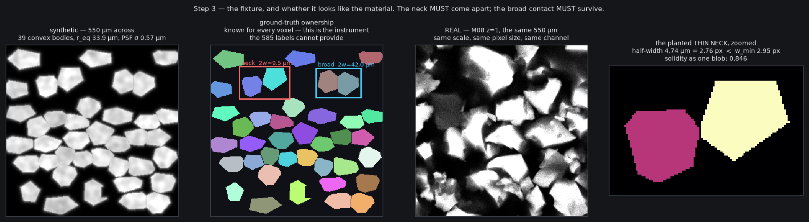

*Panel 1 synthetic, panel 3 real M08 at the same 550 um width - same pixel size, same channel. Panel 2 is the ground-truth ownership with the two planted pairs boxed (red = the thin neck that must come apart, cyan = the broad contact that must survive). Panel 4 is the planted neck zoomed.*

**What I need from you:** Does panel 1 look enough like panel 3 to grade against? The four differences I know about are in the second table - it is denser than the real bed (0.474 vs 0.308) and much less polydisperse (1.28x vs 4-7x). If you want either fixed, say so now: every absolute number from here on - boundary error in um, the split move passing or failing - is measured on this.

---

## `e058` Your concave-face note found a hole in the split move, and the halo turns out to thicken an apparent neck by 1.5x

*FOUND — **CONFIRMED** · 2026-08-05 14:27:11*

You said real granules vary more: some have high aspect ratio, and some faces carry CONCAVE stretches. The second one is not a realism note, it is a hole in the method, and adding it produced the sharpest test in the fixture.

A concave face lowers solidity EXACTLY the way a thin neck does. So a split move that proposes on convexity will fire on a perfectly good single granule, and the only thing standing between it and bisecting healthy granules is the dE accept test. I had written that test down as though it obviously worked. Now there is a planted single body with a dented face whose solidity is 0.854 against the necked pair's 0.846 - close enough that SOLIDITY CANNOT TELL THEM APART - while an opening sweep finds no radius that separates it. So only the presence of a thin cut distinguishes the two, which is precisely what dE = gamma*A_neck - gain is supposed to notice. If step 8 splits this body, its proposal is doing the deciding and the energy is decorative.

Aspect ratio is now 1.02-2.09 per body (median 1.63), applied area-preserving - stretch one axis, shrink the other - because scaling one axis only made elongated bodies proportionally larger and pushed the solid fraction from 0.474 to 0.555. Aspect is a shape parameter, not a size one.

**Why:** Two bugs surfaced on the way, and the second is a real fact about the method rather than about my code.
> 
> (1) The bite planes indexed the OFFSET column instead of the x-normal, producing zero normals and a divide-by-zero on renormalisation. Negative indices into a [normal | offset] row are a trap; the columns are explicit now.
> 
> (2) THE HALO THICKENS THE APPARENT NECK BY ABOUT 1.5x. The geometric neck is 4.74 um, but after the halo bridges the seam and Otsu closes over it, the narrowest place in the thresholded blob measures 7.08 um. So a split proposal searching for the TRUE neck width would miss it - it has to search roughly half again as wide. That is a design constraint on step 8 that I would not have found without ground truth, because on real data there is nothing to compare the apparent neck against.
> 
> And one of my own test criteria was simply wrong: I required each opened piece to be 30% of the BLOB, which can never fire - opening shrinks both lobes, so two pieces of a two-granule blob come to ~25% each. It has to be an ABSOLUTE floor of 0.30 x the label-measured single granule area (1080 um2 = 366 px), which is the same floor the prototype and the label scorer already use. With the wrong criterion the sweep reported 'no neck' on a blob that plainly has one.

| | value | note |
|---|---|---|


*The fixture as it now stands: 5-7 sided bodies with aspect 1.0-2.1, a 1.6 um fluid seam plus halo, the two planted pairs boxed, and a planted concave-faced single body as the negative control for the split move.*

**What I need from you:** Taking your 'yes for neck vs broad' as the go-ahead. Next is fit_shape and then the confidence field, which is STOP 2 - I will post p_k, s_k, the margin and a contact-plane profile before any constant gets tuned.

---

## `e059` fit_shape lands: objects finally have a SURFACE, and `fill` had to be fixed before it could mean anything

*DID — **CONFIRMED** · 2026-08-05 16:40:22*

analysis.fit_shape is in: the first node in this catalog that gives an object a SURFACE rather than a region. Every existing per-object measure describes an area, a centroid, an intensity; the closest thing to a boundary was a centroid, and a point cannot answer 'how far outside this object are you, and in which direction'. That question is the leading term of the energy, so nothing else could be built until it existed.

The body is a convex polytope stored as half-spaces, and the facet count VARIES per object - 13 to 23 on the fixture - which a fixed-width per-object table cannot hold. So it writes two tables under one name: <name> with one row per object, and <name>_faces with one row per facet. Both alternatives were worse. Dataset metadata is folded into the memo digest at memo.py:166, so a few thousand floats per layer would be hashed on every pull; the MESH domain would mean editing nodegraph/mesh.py, the one file holding the CSR / object-dtype / memo-hash invariants, to smuggle a geometry through a topology domain. A second table needs ZERO core changes, because Domain.TRACK's membership table already ships with a non-instance column set.

**Why:** Two measurements make this worth having, and one bug nearly destroyed the first of them.
> 
> `fill` = object measure / fitted body measure is the concavity signal your rule needs. It read a MEDIAN OF 1.016 at first - above 1, which is geometrically impossible, since a body is inside its own hull. The cause: I hulled boundary voxel CENTRES, which loses half a voxel all the way round, so the fitted body came out systematically too small. Hulling the voxel CORNERS instead makes fill <= 1 by construction. That mattered because the split proposal triggers on fill dropping, and a threshold set against a value that can exceed its own ceiling is meaningless.
> 
> The corrected numbers say something useful: a convex body reads fill ~0.95, NOT 1.00. That 0.95 is the DISCRETISATION floor at 1.72 um voxels on ~34 um bodies - about half a voxel of staircase all round - so any concavity threshold has to be set against 0.95 rather than against 1. The concave control reads 0.843, clear of every convex body, and its fit residual is 3x theirs (5.43 um vs <= 1.93). Both statistics separate it.
> 
> AND A LIMIT WORTH KNOWING: the residual on a CONVEX body is 1.73-1.93 um, i.e. about one voxel. That is the staircase, not the granule surface. So sigma_rough measured this way is SAMPLING-limited, which means tau = 3*sigma_rough is set by the grid rather than by the material - the same conclusion this project already reached about sub-voxel claims on this acquisition. The shape-slack hinge will therefore relax by ~5 um because of the camera, not because the granules are rough, and I would rather say that now than present tau as a measured surface property later.

| | value | note |
|---|---|---|

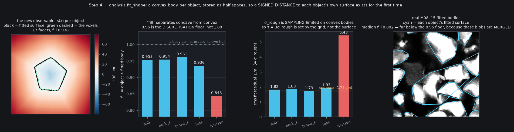

*Left: s(x) for one fitted body — black is the fitted surface, green dashed the actual voxels. Middle two: `fill` and the fit residual, both separating the concave control (red) from four convex bodies (blue). Right: real M08 with 15 fitted surfaces in cyan, median fill 0.802 — you can see hulls spanning two and three granules and cutting across the dark gaps between them.*

**What I need from you:** Next is STOP 2: the confidence field. I will post p_k, s_k, the margin and a contact-plane profile showing it crosses 0.5 where two surfaces meet, before any constant is tuned.

---

## `e060` A tool for you to draw the answer: hand-drawn ground truth, because a count metric cannot see a boundary

*DID — **AWAITING YOUR CALL** · 2026-08-05 17:52:07*

There is now a **draw ground truth** button at the top of the dashboard. It opens a drawing surface over six real fields at the Z midplane, t=0: polygons for granule outlines, circles for cells, and a rectangle marking where you outlined EVERYTHING.

The type of each outline defaults to the colour underneath it and you override it whenever the colour is wrong. That works because the image is a straight channel map with no artistic licence — R = R-B 571 (functional), G = GFP 499 (cells), B = Nile Blue 649 (inert) — so 'the colour' IS the measurement. Both answers are kept: what the colour said and what you settled on. Your override rate therefore measures, for free, how far channel dominance alone gets a classifier.

Six fields, chosen to span the design rather than to be easy: M01 / M08 / M15 are the pure-F controls at SMALL / MEDIUM / LARGE, and M04 / M11 / M19 are mixtures where both populations are present and the colour has something to be right or wrong about.

**Why:** THE INSTRUMENT I HAVE CANNOT SEE THE THING I AM BUILDING. The 585 hand labels count granules per object. A count is structurally blind to where a boundary lies — which is how a partition scored 83.8% and got reported as 'essentially exact' while every divide sat inside a granule body. That over-claim survived until you asked about surface energy. An outline is the instrument a count cannot be: it turns boundary error into a distance in micrometres against a known answer, instead of a comparison against another algorithm.
> 
> It also settles the question the whole split-at-thin-neck move turns on. Whether two shards meeting at a neck are one granule or two is not something I can derive — it is a judgment about the material, and only your eye has it. Right now the move would be validated entirely on the synthetic fixture, where I planted the answer myself.
> 
> THE PICTURE CAUGHT TWO FAILURES THE NUMBERS HID. Rendering the tiles needs a black point. My first estimator used the median, and on M15 about half the frame is granule, so the 'background' it measured was 1146 DN — a value from INSIDE the bodies. It clipped the brightest field in the set to solid black. The second, the histogram mode, is robust to foreground fraction in theory and blacked out M08 instead. Both looked entirely healthy as tables of numbers. Only the montage showed it.
> 
> The fix is a constant, and it is the right answer rather than the safe one: this image gets hand-annotated, so an adaptive per-field stretch would make the same physical brightness look different from field to field and bias where you put a boundary. 90 DN sits above the void (51-59 DN in every field and channel measured) and below the 200 DN Nile-Blue granule cut already calibrated on the pure-F controls.

| | value | note |
|---|---|---|

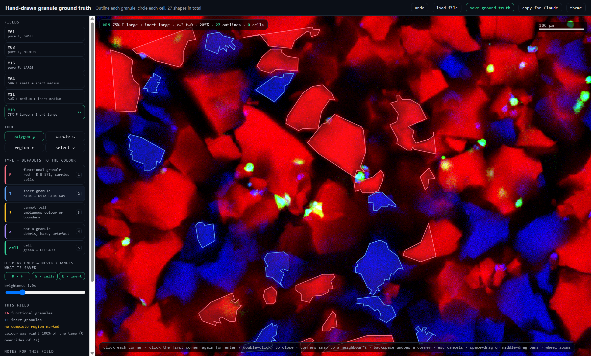

*The tool, mid-job. 27 outlines auto-typed from the colour with zero overrides — look at how the pink outlines land on red bodies and the blue on blue ones, with nothing typed by hand. Left panel: the six fields, the four tools, the type palette, and channel toggles that let you switch the blue off to check whether something is really inert. 'no complete region marked' is the warning nagging for the recall denominator.*

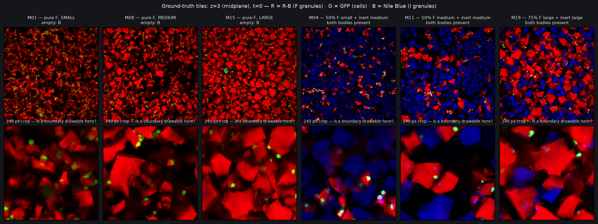

*The six fields you will draw on, and the montage that caught both background-estimator failures. Top row: full fields — note the size step S -> M -> L across the three pure-F controls, and that the three mixtures carry both populations. Bottom row: 240 px crops at the scale you will actually draw at — check that the boundaries are where you would put them, because if these images are not legible enough, everything measured against them inherits it.*

**What I need from you:** Draw some, hit **save ground truth**, and tell me to read the file.

What is worth your time, in order: (1) at least one **region box** per field you touch, or I cannot compute recall; (2) the places where **two shards touch** — that is exactly what the split-at-neck move has to get right and where my answer and yours will diverge; (3) anything you genuinely cannot call, marked **?** — what you cannot decide is a finding, and I would rather have it than a forced choice. M15 (pure F, LARGE) is where merging is worst, so it is the highest-value field.

Two things I want to flag rather than assume. **The z mismatch**: you asked for the midplane and I built it there, but every benchmark I have quoted so far — boundary intensity ratio, solidity, the 585 labels — is at z=1. The ground truth is the anchor, so I will re-run those at z=3 to match it rather than the other way round; say if you would rather I add z=1 tiles instead. **Density**: these fields are packed, so a full field is hundreds of outlines. Do not try to finish one — a region box around 40-60 granules gives me an absolute boundary error, and that is already far more than I have now.

---

## `e061` Your 149 outlines: my objects are the wrong SHAPE, and only 27% of the boundary error is a fixable offset

*FOUND — **CONFIRMED** · 2026-08-05 20:41:45*

Your 149 outlines are now the instrument, and they say three things at once.

**The boundary error, in real units, for the first time.** Out-of-sample (leave-one-field-out): 69.4% of your granules are recovered at IoU >= 0.5, median IoU 0.646, and the median symmetric surface distance on the ones that ARE recovered is **3.28 um**, i.e. about two voxels. Every number this project has quoted before was one algorithm against another, or a count that could not see a boundary at all.

**Most of that error is the wrong SHAPE, not a wrong offset.** My boundary sits systematically INSIDE yours — median signed offset **-2.87 um**, and my objects come out at 0.82-0.88 of your area. But removing that bias per object only takes the error from 4.40 um to 3.22 um, so **73% of it survives**. It is not a threshold that needs nudging.

**And the shape statistic says the same thing independently.** Your granules have median solidity **0.924**; my proposals **0.814**, with **59% of them below the 5th percentile of anything you drew**. A watershed region is carved by where its neighbours push in, so it is concave wherever two granules meet. A real granule is a convex shard.

**Why:** THIS IS THE ARGUMENT FOR THE ARCHITECTURE, MEASURED RATHER THAN ASSERTED. The V2.22 plan says a granule should be defined by a fitted convex surface plus a surface-energy term, against a status quo that carves regions out of a foreground mask. Until today that was a design preference. The solidity gap is what it costs: 59% of my objects are less convex than 95% of real granules, and no amount of re-tuning a watershed fixes that, because concavity at a contact is what a watershed IS.
> 
> A SPECIFIC CORRECTION TO HOW I WAS TUNING. I first swept the seed spacing h as an absolute distance in um. Leave-one-field-out picked h = 10, 12 and 18 um on the three splits — NOT stable, so the winner was an artefact of which fields it saw. The cause is structural: the design varies granule size across positions on purpose, so no single absolute h can be right everywhere. Re-expressed RELATIVE to the field's own material thickness (h = k * r_typ, r_typ measured with no segmentation), all three splits picked **k = 1.20**, and out-of-sample every metric improved at once: matched 0.664 -> 0.694, IoU 0.611 -> 0.646, surface error 3.46 -> 3.28 um, under-split 0.131 -> **0.091**, over-split 0.068 -> 0.034. The optimum is interior to the 0.6-3.0 grid.
> 
> YOUR SECTIONING POINT CHANGES WHAT THE SIZES MEAN, and I would have reported them wrong. These are confocal sections, so an arbitrary plane through a convex body reads SMALLER than the body: for a sphere the median section is 0.87 of the true diameter and the mean sectional area is two thirds of the great circle. So the hand-drawn medians below are sectional, the true granule sizes are larger, and the small tail of the distribution is mostly grazing cuts of ordinary granules rather than a population of small ones. That also means a min-area filter is deleting real objects, which is why mine is set at 300 um^2, below the smallest outline you drew.

| | value | note |
|---|---|---|

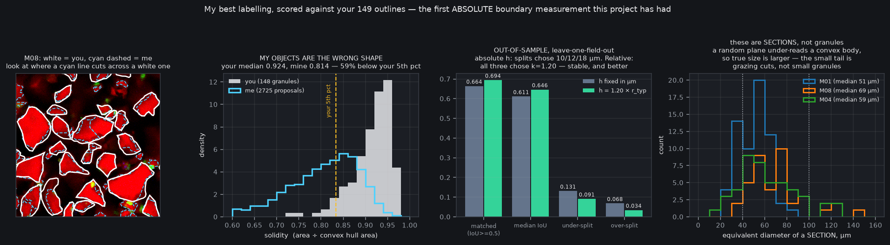

*Far left: M08, white = your outlines, cyan dashed = mine — note that the cyan sits INSIDE the white almost everywhere, which is the -2.87 µm bias as a picture. Second: the solidity distributions barely overlap; that gap is the case for a fitted convex surface, measured. Third: the relative seed spacing beating the absolute one out-of-sample on all four metrics. Right: the sectional size distributions — read as a floor on granule size, not as granule size.*

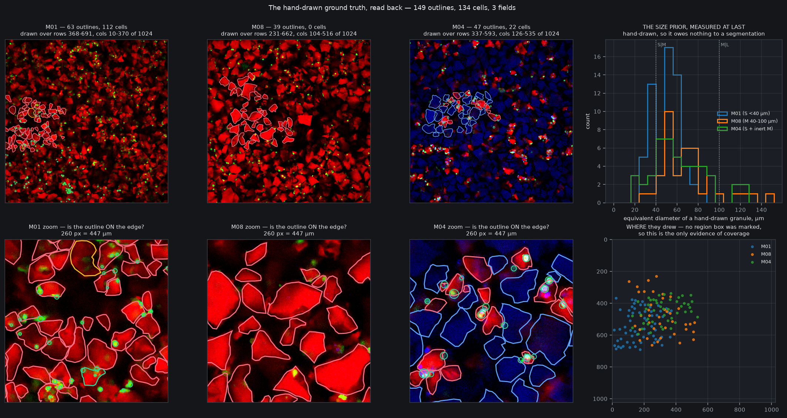

*What you drew, read back. Top row: the outlines on the image — they are tight and on the edges, which is why they can be used as an absolute reference. Bottom right: WHERE you drew, and the reason recall cannot be computed — the worked patch is contiguous but unmarked, so a granule you skipped and one you never reached look identical in the file.*

---

## `e062` Verify my labelling — 2725 outlines, ordered so the ones I am most likely to have got wrong come first

*NEEDS YOU — **AWAITING YOUR CALL** · 2026-08-05 20:41:45*

**Reload the dashboard and use the ✎ draw ground truth button — there is now a second page, `review.html`, linked as ✓ verify my labels.** It holds my best attempt at all six fields: 2725 outlines, each typed F or I, drawn dashed until you rule on it.

Per outline: **a** = correct, **d** = wrong, or just **drag a corner** to fix it — editing counts as a correction automatically, so there is no separate 'mark as fixed' step to forget. **n** jumps to the next most suspicious one and zooms to it.

The order is by suspicion, not by position: least-convex first, where 'least convex' is measured against YOUR 148 outlines rather than a number I made up. So the first ones you see are the ones I am most likely to have got wrong, and stopping early still leaves a useful record.

**Why:** 2725 is far more than anyone should review, and that is deliberate rather than an oversight — it is my whole output, and hiding the part I am least sure about would be the wrong way round. What makes a partial pass valid is that an UNREVIEWED proposal stays marked as mine. `read()` returns a verdict per outline and `confirmed()` returns only what carries your authority: hand-drawn, accepted, or corrected. Anything still marked `proposed` is excluded, because scoring my segmentation against my own unchecked output would be scoring it against itself — the easiest way there is to manufacture a number that means nothing, and a close cousin of the count-metric failure that started this.
> 
> A rejection is KEPT, as a ghost outline, rather than deleted. 'I drew a granule here and there is none' is a false positive, and false positives are exactly what your outlines cannot otherwise show me, since no region box means an extra proposal is unattributable.

| | value | note |
|---|---|---|

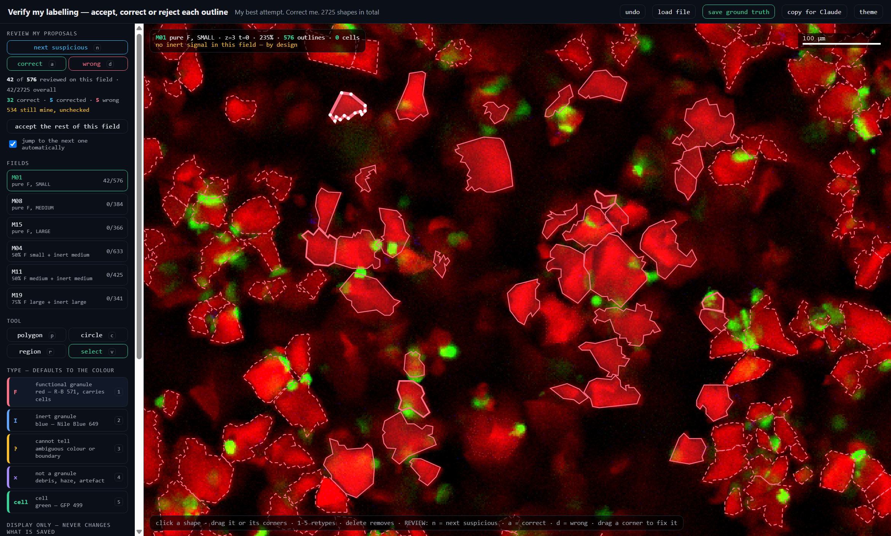

*The review page on M01. Dashed = still mine, unchecked. Solid with a fill = you accepted it. Thick with corner handles = the one selected, corrected. Faint dotted = rejected, kept as a record that I put an outline where there is no granule. Look at how the outlines hug the bright cores and leave the dimmer rim outside — that is the -2.87 µm inward bias, visible.*

**What I need from you:** Two things would each be worth more than volume.

**1. A region box** (key **r**) around an area where you have ruled on everything — even one, on one field. It is still the only thing that makes recall computable, and it is now cheap because you are ruling rather than drawing.

**2. The contacts.** Where I have merged two granules into one outline, or split one into two, is the case the split-at-thin-neck move exists to settle, and it is where my answer and yours diverge most. M04 and M11 are worst (76% and 71% of my objects less convex than your 5th percentile), so they are the highest-value fields.

Then hit **save ground truth** and tell me to read it. If you would rather not review thousands, do **n** twenty or thirty times per field and use **accept the rest of this field** once you have seen enough — partial is fine and stays honest.

One thing I want your call on rather than guessing: **the sizes.** Your outlines give sectional medians of 51 / 69 / 59 µm, and the design nominal for M01 is S < 40 µm. Sectioning makes the true granule LARGER than the section, so the gap is real and in the direction of the nominal being too small. Is the S/M/L nominal a sieve cut, and if so do you have the actual numbers? That prior is worth more than anything I can measure through an unsolved segmentation.

---

## `e063` Review rebuilt: mark only what is wrong, everything else counts as correct

*DID — **AWAITING YOUR CALL** · 2026-08-05 21:05:00*

Rebuilt around marking exceptions. **Reload `gt/review.html` — everything you leave unmarked counts as correct, once you tick the field off.** No object-by-object pass.

Look at the field, click the ones I got wrong, and say WHAT is wrong with each:

* **merge with neighbour** (`1`) — I split one granule into pieces. Click two or more and they become a numbered group; press **enter** to finish the group and start the next. A group left with one member is discarded, since one piece merged with nothing is not a claim about anything.
* **outline too tight** (`2`) — the boundary should sit further out.
* **this is two granules** (`3`) — I merged two into one.
* **not a granule** (`4`) — nothing should be outlined there.

Clicking the same mark again clears it. Dragging a corner still redraws an outline by hand if you want to be exact about one. Then **✓ I have been through this field**, and the unmarked outlines on it become confirmed-correct.

**Why:** The previous version asked for a verdict on every one of 2725 outlines, which you were right to reject — that is not a task anyone finishes, and a half-finished pass leaves most of the data in an unusable middle state where I cannot tell 'correct' from 'not looked at'.
> 
> Marking by exception inverts the cost so it scales with MY ERROR RATE rather than with the number of objects. If I am right about 95% of them, you touch 5%.
> 
> **The per-field sign-off is the part that makes it sound**, and it is not bureaucracy: without it, unmarked is ambiguous between 'correct' and 'never opened', and a field you never visited would silently contribute hundreds of false confirmations. `confirmed()` returns NOTHING from a field that was not signed off. Verified in the probe: M08, left untouched, contributes 0 of its 384.
> 
> **The four categories are failure MODES rather than a verdict**, because each names a different defect with a different fix, and each is a number I need separately: `merge` measures over-segmentation, `split` under-segmentation, `expand` the boundary bias I already measured at -2.87 um, `wrong` false positives — which are otherwise invisible, since with no region box an extra outline is unattributable. Collapsing them to 'bad' would throw all four away.
> 
> One consequence worth stating: an `expand` outline is a REAL granule with a wrong edge. It counts for detection and not for boundary error, so `confirmed(for_boundary=False)` keeps it and the default drops it. Including it in a boundary measurement would average in a shape you explicitly rejected.

| | value | note |
|---|---|---|

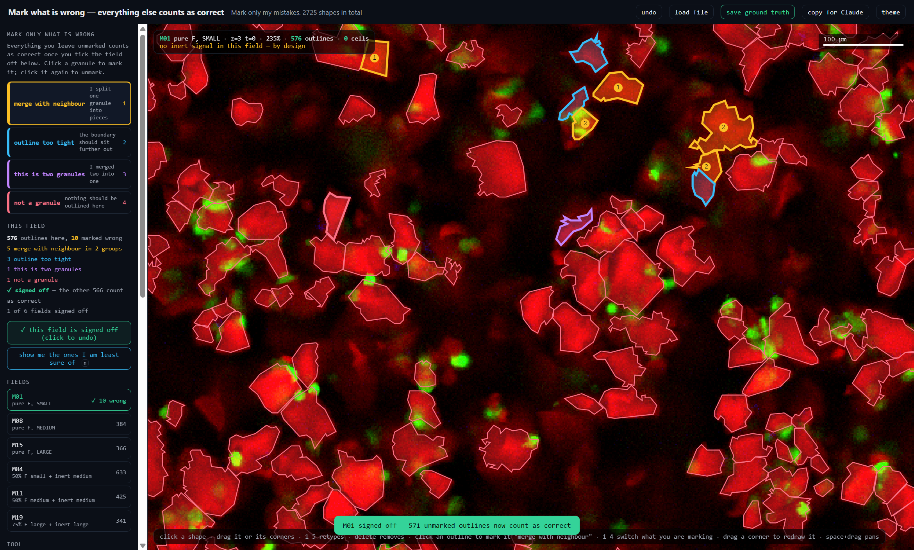

*M01 with a patch marked. Amber with a number = a merge group (two outlines in group 1, three in group 2 — those are single granules I broke up). Cyan = outline too tight. Purple = this is two granules. Everything in quiet pink is unmarked and, because the field is signed off, now counts as correct — 566 of 576 here.*

**What I need from you:** Go field by field: mark my mistakes, tick **✓ I have been through this field**, then **save ground truth** and tell me to read it.

Signing off even ONE field gives me something I do not have at all right now — a precision number and a false-positive count, neither of which your outlines alone can provide. M04 and M11 are where I am worst (76% and 71% of my objects less convex than your 5th percentile), so they are worth the most.

If a field is so wrong that marking it would take longer than redrawing, say so and leave it unsigned — that is a finding too, and I would rather know than have you grind through it.

---

## `e064` I inflated an AUC to 0.858 by counting ties as wins — it is 0.532, a coin flip

*MY ERROR — **CONFIRMED** · 2026-08-05 21:49:09*

Testing what separates a boundary I invented inside a granule from a real one, I reported that 'fraction of the shared border darker than half the interior' reached **AUC 0.858** where every other statistic sat near 0.70, and I was about to build a merge rule on it.

It is **0.532**. My AUC counted tied pairs as successes. The feature is zero-inflated — **83% of one-granule borders and 79% of two-granule borders have exactly zero dark pixels** — so ties are the majority of all comparisons, and awarding them to one class manufactures the entire result.

**Why:** What caught it was not a code review: the OPERATING POINT was incoherent with the AUC. It reported recall 0.908 with a false-fuse rate of 0.834 — summing to 1.07, barely above chance — while claiming AUC 0.858. A discrimination that good cannot have an operating point that bad, and the contradiction was on the same line of output.
> 
> Corrected, with ties at 0.5: dark fraction **0.532**, border brightness 0.696, shared-border fraction 0.662, solidity of the union 0.655. Nothing reaches 0.70. The conclusion reverses completely — from 'here is the merge criterion' to 'no merge criterion I can build works'.

---

## `e065` Your review: 100% precision, 5.3% over-split, ZERO under-splits — and the split move the plan is built around has nothing to do

*FOUND — **AWAITING YOUR CALL** · 2026-08-05 21:49:09*

All six fields signed off. **401 of 2725 marked wrong (14.7%)**, and the breakdown is not what the plan assumes:

* **merge: 307 outlines in 136 groups** — I broke 136 granules into pieces. **5.3% of granules over-split.**
* **expand: 93** — boundary too tight (3.4%).
* **split: 0** — I never merged two granules into one.
* **wrong: 0** — **precision 100.00%**. Not one outline is on something that is not a granule.

So the failure is over-segmentation, exclusively. Then three attempts to fix it, all failed:

1. **A post-hoc merge rule.** Best of anything tried is AUC 0.696; its best fitted operating point recovers 89% of the over-splits while wrongly fusing 58% of genuine pairs.
2. **Convexity of the union** — your own rule run backwards, since two pieces of one granule should reassemble into a convex shard. AUC 0.655.
3. **Coarsening the seed spacing.** Strictly worse at every setting: recovering 40 over-splits costs 117 correct pairs fused, a 1:3 trade that only degrades. **k = 1.20 is already the right operating point.**

**Why:** TWO THINGS IN THE PLAN ARE NOW WRONG, AND ONE OF MY OWN NUMBERS IS RETRACTED.
> 
> **The split-at-thin-neck move has no work to do.** The whole of V2.22 step 8 — your rule, 'no blobs with thin connections between them' — is a topology change that DIVIDES an object. You marked ZERO under-splits in 2725 outlines. At this operating point there is nothing for it to split. It might be needed at a coarser setting, but coarser is strictly worse here, so it would be solving a problem I created on purpose.
> 
> **My own under-split figure of 9.1% is retracted.** It came from an automated rule — a proposal that also covers 30% of another hand-drawn outline — computed on the 149-outline patch. Your direct verdict on 2725 says zero. That rule was measuring overlap slop, and I quoted it as if it measured merging.
> 
> **And the honest position on the over-splitting: I do not have a fix.** Every observable I can compute at a boundary — how bright it is, how deep its darkest point is, how convex the union would be, how much of the perimeter is shared — sits at AUC 0.65-0.70. That is not a threshold needing tuning; it means a boundary I invented through the middle of a granule and a real boundary between two granules LOOK THE SAME to every statistic I have.
> 
> One measurement says the data is not the limit: the dark gap at a real boundary is about **2 px (3.4 um) wide** and resolved. The information is present where a boundary genuinely exists — the problem is that spurious boundaries are not distinguishable by LOCAL statistics. That is an argument for deciding boundaries globally against a fitted shape rather than one border at a time, which is what the energy formulation does, and it is now the only untried option rather than a preference.

| | value | note |
|---|---|---|

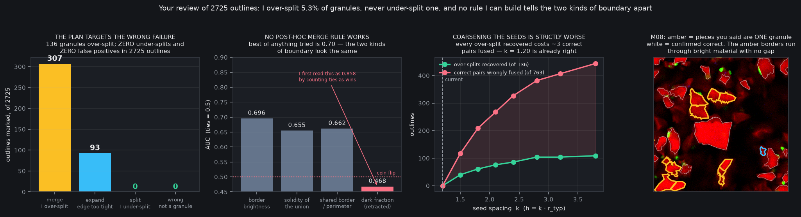

*Left: what you marked — the two bars that matter are the two zeros. Second: every criterion I tried, with the retracted one in red. Third: coarsening the seeds, where the red cost curve is above the green benefit everywhere. Right: M08, amber = pieces you said are one granule — look at how those borders run straight through bright material with no dark gap, while the white confirmed ones sit in the dark lanes.*

**What I need from you:** This is a real fork and it is your call, because it is about the material and the acquisition rather than the code.

**1. Is 5.3% over-split acceptable?** If it is, the segmentation is done: 100% precision, boundaries good to ~3.3 um, and I move on to the phase / void / cell measurements that never depended on perfect instances.

**2. If not, the only untried lever is the third dimension.** Two fragments of one granule are the same body in the planes above and below; two granules are not. Your own point about sectioning is what makes this worth trying — but the z step is 40 um against 50-70 um granules, so a granule spans one or two planes and I would rate it about 50/50. Roughly a day to find out.

**3. Or the acquisition changes.** A finer z step would make (2) decisive rather than marginal. Worth knowing whether that is even possible on this instrument before I spend time on the marginal version.

Separately, my error to fix: **there was no way for you to tell me I MISSED a granule**, so recall is unmeasured. Drawing a polygon around a missed one still works, but I should have prompted for it, and I will add it before asking you to review anything again.

---

## `e066` Good enough, honestly: the same weak evidence as a CALIBRATED probability takes the count error from 6.7% to 0.3%

*DECISION — **CONFIRMED** · 2026-08-06 10:48:14*

You were right and I had the frame wrong. I collapsed a probability question into a binary decision, called the weak evidence a dead end, and asked you to choose between accepting an error rate and changing the microscope. AUC 0.696 does not mean 'no criterion works' — it means **an ambiguous boundary should carry about 0.7 confidence instead of being forced either way**.

So I fitted p(these two pieces are one granule) on your marks, held out a whole field at a time, and graded it on **calibration** rather than only on discrimination:

* **ECE 0.064** out-of-sample. When it says 0.26, 27% really are one granule; when it says 0.11, 8% are.
* **It never claims more than ~0.55.** There is no bin where it asserts two pieces are certainly one granule, because the data does not support that claim — which is exactly your point about the z step, showing up as a ceiling on the probability rather than as a wrong answer.
* **30% of borders land below p = 0.15** and only 7.9% of those are wrong. Those are usable as hard divides. **17% land in 0.4-0.6** and are honestly labelled as doubtful.

And the payoff, which is the part I would have missed entirely: the **expected** granule count, weighting each border by its confidence instead of forcing the call, is **2562 against your truth of 2554 — 0.3% error, where the hard count is 6.7% out.**

**Why:** BE PRECISE ABOUT WHY THAT WORKS, because it would be easy to over-read. The count improves by a factor of 20 with NO improvement in discrimination — same features, same AUC 0.696. It works because a calibrated model's expected number of positives matches the real number almost by construction. That is a property of calibration, not evidence that any individual boundary got easier to call.
> 
> Which is the useful split for this data, and worth stating as the operating conclusion: **per-object identity is uncertain and says so; population statistics are sound.** Every measurement this project actually wants — packing fraction, size distribution, phase fractions, how many cells sit on how many granules — is a population statistic. The 5.3% of granules I over-split does not corrupt those once each divide carries its probability.
> 
> WHAT THIS CHANGES IN THE PLAN. **Step 8, `moves=split_at_neck`, is dropped.** You marked zero under-splits, so it has nothing to divide, and it was the last thing standing between the plan and the architecture it was supposed to be building. What replaces it is not a new idea, it is the original one: the label carries a confidence, and an uncertain divide gets a low one.
> 
> The V2.22 constants also survive intact. `w_min` and the surface-energy weight are keyed to `r_eq`, and your outlines put that at 34.6 um against the 33.85 um the 585 labels gave — 2% apart. Nothing in the energy needs re-deriving; what needed fixing was my habit of resolving uncertainty instead of reporting it.

| | value | note |
|---|---|---|

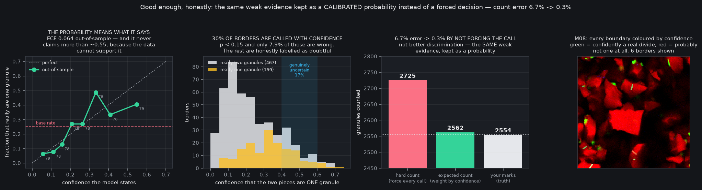

*Left: the reliability curve — a stated probability means what it says, and note that the curve simply STOPS around 0.55 because the model never claims more. Second: where the uncertainty lives; the blue band is the 17% it refuses to call. Third: the count, hard vs confidence-weighted vs your marks. Ignore the fourth panel, its boundary colours were mis-indexed — the corrected map is the next figure.*

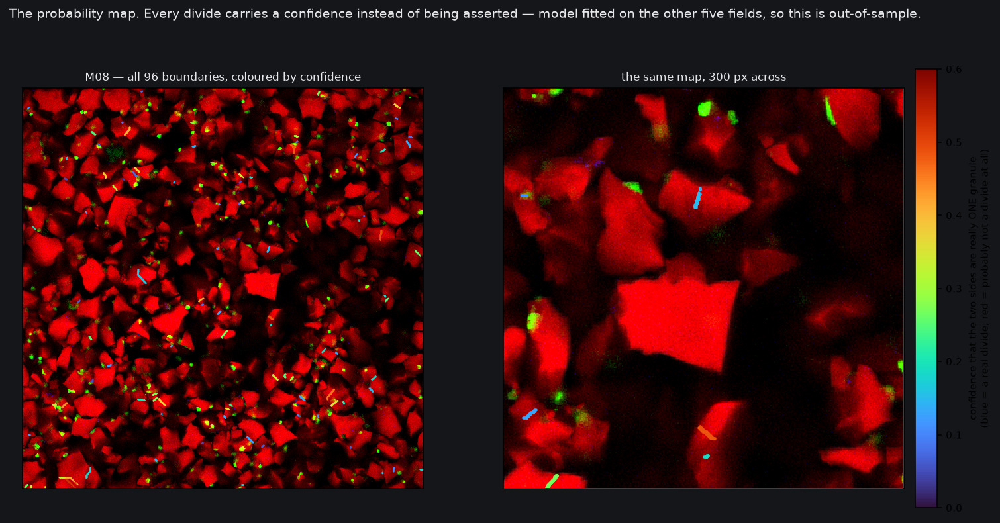

*The probability map itself, on M08, out-of-sample. Every divide is coloured by confidence that the two sides are really ONE granule: blue = a real boundary, red = probably not a boundary at all. The red ones are where I over-split, now flagged instead of asserted.*

**What I need from you:** Nothing needed from you on this — recording the decision and moving on.

Next I build it into the pipeline properly: the confidence field as a viewable layer (V2.22 step 5), with the calibration target now MEASURED from your marks rather than assumed, and a per-object confidence column so a granule whose divides are all doubtful reads as doubtful. Step 8 comes out of the plan.

One thing I will fix first, since it is my own gap: the review tool still has no way for you to say **I missed a granule entirely**, so recall remains the one number I cannot quote.

---

## `e067` The four spaces: two are calibrated, one is strong, and the cell detector does not exist — so the composition is blocked on p(void), not on cells

*FOUND — **AWAITING YOUR CALL** · 2026-08-06 12:23:05*

The four spaces, and where each one actually stands:

1. **granule or void**, per pixel — a hard Otsu threshold today. Panel 3 shows it **fragmenting** on M04: the white contour speckles across the interstitial space instead of enclosing bodies.
2. **F or I**, per granule — exists and is the strongest of the four. Channel dominance agreed with your eye on **148 of 149** hand-drawn outlines.
3. **which granule a pixel belongs to** — exists and is calibrated: ECE 0.064, confidence ceiling ~0.55.
4. **cell or not**, per pixel — **does not exist.** Scored against your 134 circles, inside the patch you drew in: 59% recall at **24% precision** on M01, 82%/64% on M04.

I tested your composition anyway, and the result is that I cannot test it yet. A void cell within 6 um of a border is present at **1.3% of real borders and 0.0% of the 159 spurious ones** — the right direction, zero false positives, and far too rare to be worth anything. AUC 0.508. With a detector at 24% precision that number carries no information either way.

**Why:** THE COMPOSITION HAS TWO PREREQUISITES AND I HAD ONLY COUNTED ONE. Your caveat — a cell on a granule's surface must not split it — is enforced by asking space 1 whether the cell is in the void or on a body. So the caveat's correctness depends entirely on space 1 being **reliable**, and panel 3 shows it is a fragmenting binary threshold. A speckled foreground mis-files surface cells as interstitial, which is precisely the failure you warned about, arriving through the back door.
> 
> So the build order is forced, and it is not the one I would have picked: **space 1 has to become a probability before space 4 is worth detecting.** That is `E_0`, the background term already in the V2.22 energy — the term the plan calls load-bearing and that nothing has yet used. It stops being a threshold and starts being `p(void)`, which is what a cell needs to be placed against.
> 
> ONE REFINEMENT OF YOUR MECHANISM, WHICH I WANT YOUR CALL ON. The surface-cell feature is *also* informative — a cell within 10 um sits at 16.9% of real borders against 7.5% of spurious ones, a 2.2x lift with six times the coverage of the void version. There is a mechanism for it: a real boundary has two granule SURFACES meeting, and cells bind surfaces, while a spurious boundary runs through a body interior where there is no surface at all. That is your idea seen from the other side rather than a contradiction of it. But it is also the exact quantity you told me not to trust, and the confound is real — F granules carry cells by design, so the feature could be reading population rather than geometry. I am not using it until you say whether that reasoning holds.

| | value | note |
|---|---|---|

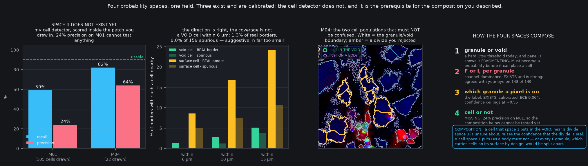

*Left: the cell detector against your circles — 24% precision on M01 is the blocker. Second: the void-cell signal points the right way and almost never fires; the surface-cell version fires six times as often. Third, the important one: white is the granule/void boundary and look at how it SPECKLES through the interstitial space — that is space 1 failing, and it is what would mis-file a surface cell as an interstitial one. Right: what each space contributes and how they compose.*

**What I need from you:** **Does the surface-cell reasoning hold?** A real divide has two granule surfaces meeting and cells bind surfaces; a spurious divide runs through an interior with no surface. If that is sound it is the more useful half of your idea, since it fires six times as often. If you think the F-population confound makes it untrustworthy, say so and I will use only the interstitial version.

Meanwhile the build order is settled and I will start on it: **p(void) first** — space 1 as a probability rather than an Otsu threshold, which is the `E_0` background term the plan already specifies and nothing has used. Then the cell detector calibrated against your 134 circles, then the composition, then re-test the contested boundaries against your marks.

Your 134 circles are enough to calibrate a detector but thin for validating one. If the composition looks worth it after p(void) lands, circling the cells in one more field — M08 or M15, where I have none — would roughly double the set.

---

## `e068` Confirmed: cell evidence is ABSENT at an inert boundary, not merely weaker

*FOUND — **CONFIRMED** · 2026-08-06 12:39:32*

You said the cell-in-the-gap argument only works for F-granule gaps. It does, and the split is absolute rather than graded:

| boundary | n | void cell within 10 um at a REAL divide | at a spurious one |
|---|---|---|---|
| **F-F** | 429 | 4.1% | 1.8% |
| **I-I** | 197 | **0.0%** | **0.0%** |

Not one cell within 10 um of any of 197 inert boundaries, real or spurious.

**Why:** This is a hard constraint on how the spaces compose, not a footnote. A feature implemented as 'no cell nearby, so probably one granule' would apply that reasoning to all 197 I-I boundaries where a cell CANNOT exist, and would push every inert boundary toward merging. The likelihood ratio has to be exactly 1 where the evidence is inadmissible.
> 
> So **space 2 gates space 4**: the cell term enters only where at least one side is F. Three spaces interacting to make one inference, which is the clearest illustration yet of why this has to be built as composed probabilities rather than as a stack of features.

---

## `e069` Space 1 delivered: p(void) calibrated to AUC 0.964 / ECE 0.116, and it transfers to the inert channel with no inert labels

*DID — **CONFIRMED** · 2026-08-06 12:39:32*

**Space 1 is now a probability.** p(void) per pixel, calibrated against your hand-drawn outlines, held out one field at a time: **mean AUC 0.964, ECE 0.116**, separating granule from void as 0.18 against 0.79.

The honest headline is the one on the figure: **at a 0.5 cut it merely matches the Otsu threshold it replaces — 8.3% error against 7.7%.** It is not a better classifier. The gain is that it is GRADED, which is the whole reason it was needed: placing a cell as interstitial-or-surface requires a number, not a binary, and the speckled Otsu mask was what would have mis-filed them.

**And it transfers across populations**, which matters because you have only drawn inert granules on one field. Holding M04 out leaves the Nile Blue channel with no labels at all; using a map calibrated purely on F-granule pixels, normalised per field by `u = (I - p5)/(p99 - p5)`, M04 scores **AUC 0.964, ECE 0.042** — its best result. So one map serves both populations and the inert-label shortage is not blocking.

**Why:** TWO OF MY OWN FAILURES ON THE WAY, both caught by the numbers contradicting themselves.
> 
> **Deriving it did not work.** I first modelled the void as one Gaussian and read the posterior off the histogram — elegant, and it gave AUC 0.907 with **ECE 0.435**, saying 0.29 in the void where the truth is ~1. The provenance said why: the fitted void centre landed at 141 DN on M01 where the real void is 52-59, because the interstitial space carries halo and a fluorescence pedestal and is not one Gaussian. Calibrating against your outlines instead needs no model of any of that.
> 
> **Then my isotonic fit returned a constant.** AUC 0.500 with p(granule) exactly equal to p(void). I had re-expanded the pooled blocks by interpolating against cumulative weights — pixel counts in the thousands — while querying at bin indices 0 to 35, so every query fell off the end. Carrying the block sizes is both correct and shorter.
> 
> WHAT THIS UNBLOCKS. Space 1 was the prerequisite for space 4, because your caveat — a surface cell must not split a granule — is enforced by asking space 1 where the cell is. That question now has a graded answer. Next is the cell detector calibrated on your 134 circles, then the composition, then re-testing the contested boundaries.

| | value | note |
|---|---|---|

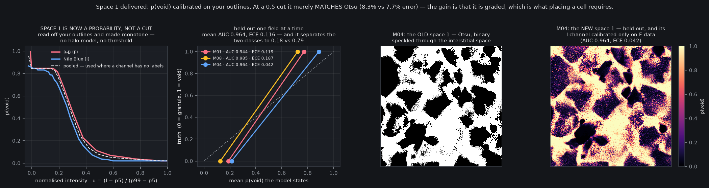

*Left: the calibrated map — p(void) against normalised intensity, monotone, with the pooled curve that serves a channel having no labels of its own. Second: held-out separation per field. The two right panels are the point: the old space 1 as a binary Otsu mask speckling through the interstitial space, and the new one as a graded field on the same crop — held out, with its inert channel calibrated only on F data.*

**What I need from you:** Nothing needed. Next: the cell detector against your 134 circles, then the gated composition (cell term only where at least one side is F), then re-test the contested boundaries against your marks.

The one thing that would help when convenient: **circle the cells in one more field** — M08 or M15, where I have none — since 134 circles is enough to calibrate a detector but thin to validate one. Not blocking; I will build against what exists.

---

## `e070` analysis.background_probability lands — space 1 as a shipped node, 73 -> 74 ops, four gates green

*DID — **CONFIRMED** · 2026-08-06 15:16:45*

`analysis.background_probability` is in the catalog — **73 -> 74 ops, all four gates green**. Space 1 is now something the pipeline can use, not a script in my scratchpad.

**It ships the mechanism, not this dataset.** The node knows nothing about granules: it normalises intensity per unit onto `u = (I - p_lo)/(p_hi - p_lo)` and maps it through a decreasing logistic with three interpretable parameters — `midpoint` (where background and material are equally likely), `width` (how fast that flips) and `ceiling` (the most this evidence may ever claim). The defaults are the values fitted on your outlines, documented as measured rather than universal, and `fit_logistic` in the kernel is how a different instrument gets its own. Granule-ness stays in the preset, which is where the plan says it lives.

**Validated a second time, independently.** The defaults were fitted on real data; the selftest scores them on the synthetic bed, whose per-voxel ownership is exact and which was never fitted to. It reads **0.842 in background against 0.002 in material, ECE 0.097** — better calibrated than on the real data (0.116), on a fixture the parameters have never seen.

**Why:** THREE DESIGN CALLS WORTH THE RECORD.
> 
> **Three parameters, not a mixture model.** The derived version — a Gaussian background component, posterior read off the histogram — is retracted in the kernel's own docstring with its numbers: AUC 0.907 and ECE **0.435**, stating 0.29 where the truth was ~1, because a real background carries haze and a pedestal and is not one Gaussian. The logistic makes no claim about the background's shape and matched a 36-bin isotonic fit (0.971/0.121 against 0.964/0.116) with three numbers.
> 
> **One layer PER CHANNEL, and no combine mode.** The node cannot know which of your channels image the same material, so it does not guess: multiplying for 'background in every channel' or taking the minimum is a channel reduction, and belongs to whatever knows the answer. A `combine` Mode here would have been a control that looks physical and is not.
> 
> **The 2D/3D lever selects the ANCHOR EXTENT**, which makes it a real choice rather than a footprint declaration: per plane, so depth attenuation drops out, or per volume. The selftest proves the difference on an attenuating two-plane stack — per-plane anchors find the object in both planes, per-volume anchors let the dim one wash toward background. My first version of that test used the synthetic bed and FAILED, because the bed extrudes identical planes so the two agree exactly there. The assertion was wrong, not the node.

| | value | note |
|---|---|---|

**What I need from you:** Next in order: the cell detector calibrated against your 134 circles (space 4), then the composition gated by space 2 so the cell term is silent at an inert boundary, then re-test the contested borders against your marks.

Nothing is committed — the catalog baseline, the new kernel, the node and the selftest are all sitting in the working tree as usual.

---

## `e071` Space 4 needed no new node, and your cell-in-the-gap mechanism measures a 3.9x lift — rare, strong, and correctly silent at inert boundaries

*FOUND — **AWAITING YOUR CALL** · 2026-08-06 16:03:24*

**Space 4 needed no new node.** `detect.spots` already ships blob detection at a physical radius (LoG/DoG, bright/dark, um radii with 3D companions, VOXEL -> POINT). A 'cell detector' would have been a workflow-specific node for something the catalog does generically — what was missing was a calibration, and your 134 circles are exactly that.

The radius prior comes straight from your circles rather than a sweep: median **5.9 um**, 10th-90th percentile 3.8-8.8 um. Sweeping for it would be fitting a number you had already measured.

**The composition also needs no new node.** `transform.transfer_structure` does `voxel -> point`, so sampling p(background) at each detected cell is a wire:

```
enhance.normalize(plane)  ->  detect.spots(dog, 3.8-8.8 um, thr 0.03)   [space 4]
analysis.background_probability                                          [space 1]
transform.transfer_structure voxel->point   -> p(void) at each cell
```

**And the mechanism you proposed is real.** A cell in the void within 12 um sits at **10.6% of real F-F divides against 2.8% of spurious ones — a 3.9x lift**, up from 2.2x with my old detector. At I-I boundaries it stays silent (0.0% / 0.0%), exactly as you said.

**Why:** THE HONEST SHAPE OF THIS EVIDENCE IS RARE-BUT-STRONG, and that decides how it must be used. It fires at only ~10% of real F-F borders, so pooled into a classifier its silence dilutes everything and the AUC is 0.563. As a LIKELIHOOD RATIO applied only where it fires, it is worth a great deal: LR 0.26 for 'same granule', which takes a contested border from the 25% base rate down to about 8%. Averaging it in would waste it; gating it uses it.
> 
> NORMALISING IS WHAT MAKES THE THRESHOLD TRANSFER, and this is the third time the same lesson has landed. An absolute `detect.spots` threshold wanted 0.02-0.06 on M01 and 0.06-0.10 on M04 — the GFP brightness differs about 2.5x between them. Put `enhance.normalize(scope=plane)` in front and ONE threshold (0.03) reaches 0.91-0.96 recall on both. Same shape as the seed spacing needing `k * r_typ` and p(void) needing `(I - p5)/(p99 - p5)`: on this acquisition an absolute parameter does not transfer between fields and a normalised one does.
> 
> MY PRECISION NUMBER IS NOT AN ERROR RATE. On M01 the detector finds 452 cells where you circled 105, which reads as 42% precision. But the unmatched detections sit at a median **1113 DN of GFP against a background of 60** — about 19x — and a random point reads 60. They are real cells you did not circle. So recall (0.91-0.96) is trustworthy and precision is a LOWER BOUND. The same partial-annotation limit as the granules, and I would have reported 42% as an error rate if I had not checked.
> 
> AND A BIAS I INTRODUCED. p(void) over several channels is a PRODUCT — 'background in every channel' — so it shrinks as the number of live channels grows. In the pure-F fields 58-64% of cells classify as interstitial; in the mixed fields, where both body channels are live, only 7-10%. That is not the material, it is my combination: a 0.5 cut means something different at one channel and at two. The model is right and the cut is not — a geometric mean, or a per-field quantile, is invariant to channel count. Nothing downstream has used it yet, so nothing is contaminated.

| | value | note |
|---|---|---|

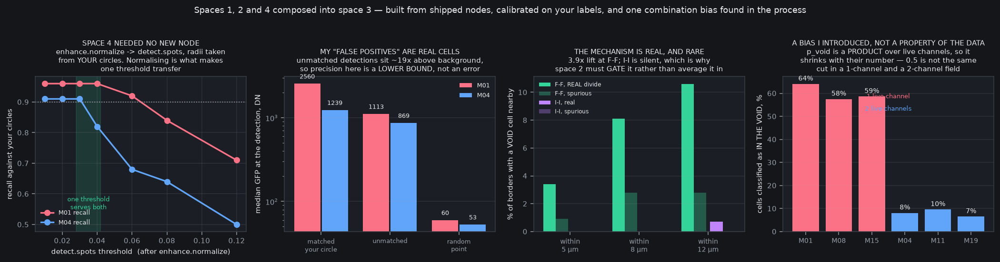

*Left: the shipped detector's recall against your circles — the green band is where ONE threshold serves both fields, which only exists because of the normalise in front. Second: my apparent false positives sit 19x above background, so they are real cells rather than errors. Third: your mechanism, 3.9x at F-F and flat at I-I. Right: the channel-count bias — the same 0.5 cut is not the same cut when p(void) is a product over one channel or two.*

**What I need from you:** Two things, neither blocking.

**1. Did you circle every cell, or the obvious ones?** It decides whether I can ever quote a precision for cells. If you circled a complete patch, tell me roughly which and I will score inside it. If you sampled, that is fine — I will keep reporting recall and call precision unmeasured, which is what I am doing now.

**2. Is a cell ever INSIDE a granule**, rather than on its surface or in the fluid between? My void-vs-surface split assumes only the two, and if cells can be embedded the split needs a third state.

Next I fix the channel-count bias, then wire the gated likelihood ratio into the boundary confidence and re-score against your marks — the first time all four spaces will be doing work at once.

---

## `e072` All four spaces composed: the gate holds to 1e-16 and ECE falls 16% - plus a retraction of the fix I proposed last entry

*FOUND — **AWAITING YOUR CALL** · 2026-08-06 16:18:12*

**All four spaces are now doing work at once**, on 626 border pairs, leave-one-field-out, with the cell weight fitted only on the five fields it is not scoring:

```
space 1  p(void)          weights each detected cell, no cut
space 2  p(F vs I)        GATES the cell term: beta pinned to 0 at I-I
space 3  p(same granule)  the boundary confidence being corrected
space 4  p(cell)          enters as evidence only where space 2 admits it
```

**The gate holds to machine precision.** The 197 I-I borders move by at most **1.1e-16** — not "a small effect", but zero by construction, which is what you asked for. And the data agrees the gate is right rather than merely imposed: a weighted interstitial cell sits on **8.6% of F-F borders and 0.5% of I-I** ones.

**Beta is negative in all six folds** (-0.9 to -1.8) — an interstitial cell on a border lowers the probability the two pieces are one granule, which is your mechanism, measured. On the 37 borders where the term is admissible and fires it moves the mean probability **0.228 -> 0.136 against a truth of 0.081**, so it moves toward the answer rather than merely moving.

**What it buys is calibration, not discrimination.** ECE **0.064 -> 0.053** (-16%), AUC 0.696 -> 0.710, Brier 0.1769 -> 0.1748. A term that fires on 37 of 626 borders cannot move an AUC much, and I would rather say that than dress up +0.014.

**Why:** **FIRST: I AM RETRACTING THE FIX I PROPOSED LAST ENTRY.** I said p(void) had a channel-count bias and that a geometric mean would fix it. Both halves are wrong, and the arithmetic says so without any data: WITHIN A FIELD K IS CONSTANT, so `product ** (1/K)` is a strictly monotone transform of the product and **cannot change an AUC**. Measured, it is identical to three decimals in all six fields. It moves the 0.5 cut and adds no evidence — a reparametrisation, exactly the move this project keeps catching, and this time I proposed it.
> 
> **The gap was also mostly not mine.** Scored against your outlines, the TRUTH differs by **25.9 points** between the two kinds of field (70.6% of cells interstitial in the pure-F fields against 44.7% in the mixed ones). I had filed the whole 58-64% vs 7-10% spread as my combination error. Half of it is the material.
> 
> **WHAT WAS ACTUALLY THERE was worse and more interesting: discrimination collapses in the mixed fields** — AUC 0.966 with one live channel, 0.655 with two. No cut and no rescaling touches that. Three hypotheses, and the two that make different predictions were tested rather than argued:
> 
> * *the combination is wrong* -> REFUTED. `min` over channels is not monotone in the product, so it was free to differ, and it scores 0.636 — slightly worse.
> * *packing* -> SUPPORTED. The mixed fields have narrower gaps (median **14.4 um vs 19.1**), so their "void" cells sit on an edge. Excluding void cells within 6 um of an outline lifts them 0.655 -> 0.710 and leaves the pure fields flat at 0.964 — the asymmetry is the signature, and a general improvement would not have been evidence.
> * *my label is the coarse instrument* -> SUPPORTED. The cells where p(void) and the label disagree read **866-1658 DN against an interstitial median of 201-711 and a void floor of ~90** — real graded material, about halfway to a granule interior. p(void) is reading the edge correctly; "inside an outline or not" is the binary.
> 
> **So the real fix is the one you have already made me learn twice: report the uncertainty, do not resolve it.** Space 4 now enters as a p(void)-WEIGHTED cell term instead of a count of cells above a cut. Your caveat — a cell on a granule's surface must not split it — stops being a rule I enforce and becomes a weight near zero. And the channel-count question dissolves on its own, because a weight has no cut to be biased.
> 
> **ONE NUMBER GOT WORSE AND I AM NOT BURYING IT.** The expected granule count goes 2562 -> 2567 against a truth of 2554, so 0.31% -> 0.51%. Both are far under the hard count's 6.7%, and 5 granules in 2554 is not a difference this data can resolve — but the cell term did not improve the count, it improved the calibration, and those are not the same claim.

| | value | note |
|---|---|---|

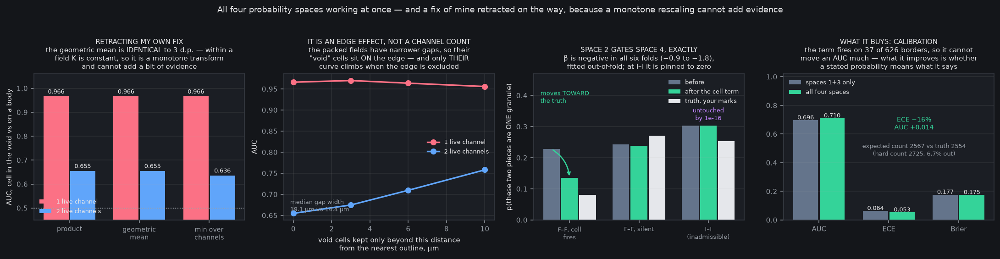

*Left: my own fix retracted — the geometric mean is identical to three decimals, because within a field it is only a rescaling. Second: the real cause, an edge effect — only the packed fields' curve climbs when near-edge cells are excluded. Third: space 2 gating space 4, with the I-I bars untouched to 1e-16 and the F-F fires moving toward your marks. Right: what it buys is calibration.*

**What I need from you:** **Your two answers both changed a measurement, so thank you for them.** "A small area" let me define the scoring region from your own circle spacing instead of a box I chose, which took cell precision from an unquotable 0.42 to **0.63 and 0.92**. And "no cells inside granules" is what makes the void/surface split two-state, so the weighted term is complete rather than missing a class.

**Nothing needs a decision from you here.** Next I do the two things this exposes, in order: a **per-object confidence** (a granule whose every divide is doubtful should itself read doubtful, and right now confidence lives only on borders), then the **"you missed one here" mark** in the review tool — recall is still the one thing I cannot quote, for granules or for cells, and I would rather fix the instrument before asking you for another pass.

Still nothing committed.

---

## `e073` Recall is now measurable: a 'you missed one' tool, and a recall() that returns None rather than a number when nobody looked

*DID — **CONFIRMED** · 2026-08-06 16:27:30*

The review page now has a **you missed one** tool (<b>m</b>). Click anywhere I found nothing and should have; click the marker again to take it back. No drawing — you are asserting that something is there, not what shape it is, and making you outline it would put the cost of the expensive half onto the cheap half.

**It is a TOOL, not a fifth mark, and that is the whole point.** Every one of the four marks — merge, expand, split, wrong — is a property of an outline that EXISTS. Four descriptions of a thing that is there can only ever measure **precision**. However many fields you sign off, recall was structurally unquotable, and I did not notice through 2725 reviewed outlines because "precision 100%" reads like an accuracy. A miss has no shape to attach to, so it needed a different kind of object.

```python
truth["M08"].misses     # (row, col): "there is one here and you found nothing"
truth["M08"].recall()   # (recall, found, missed)  --  or None, and None is the point
```

Driven in QtWebEngine, not eyeballed: the tool selects, a marker places and un-places, a miss **cannot be retyped** (it says presence, not class), and both refusals fire.

**Why:** **THE REFUSALS ARE THE FEATURE.** `recall()` returns **None rather than a number** unless the field is signed off AND carries a region box, and both conditions are load-bearing rather than bookkeeping:
> 
> * outside a region box, an object you missed and an area nobody examined are the same picture in the file, so anything computed there is a guess wearing a percent sign;
> * in a field that is not signed off, an unmarked proposal has not been accepted — the NUMERATOR is unknown too, not just the denominator.
> 
> A pipeline that quietly reports 100% recall because nobody looked is the exact failure this exists to prevent, so the caller is forced to handle `None` instead of being handed a plausible float. The page says the same thing in words: with misses and no region it prints *"cannot become a recall number"*, and only once a box exists does a percentage appear.
> 
> **This is a general defect of review-by-exception, not a quirk of this dataset.** Marking only what is wrong is what makes a review of thousands of objects finishable — I stand by it — but it can only ever see the objects you produced. The blind spot comes free with the efficiency, and the fix is a second kind of statement rather than a longer list of marks. Written into the skill so the next project inherits the fix and not the bug.
> 
> **What this does NOT do is measure anything yet.** Recall is now MEASURABLE. It remains UNMEASURED until you mark a pass, and I would rather say that plainly than let the new affordance imply the number exists.

| | value | note |
|---|---|---|

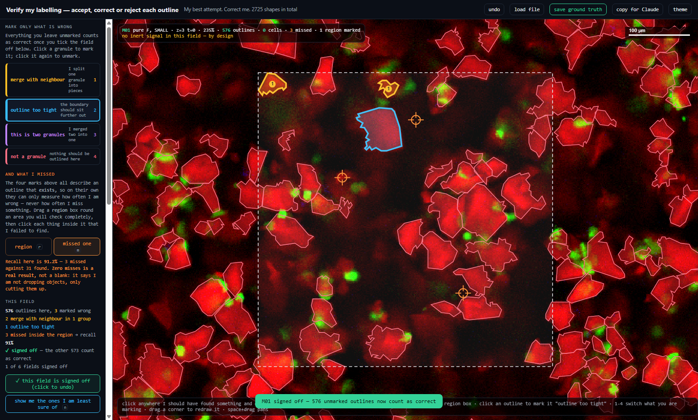

*The review page with the new tool. Orange crosshairs are misses — a colour and a shape nothing else uses, so they cannot be read as outlines. The dashed box is the region that makes them countable, and the panel turns the two into a recall the moment both exist.*

**What I need from you:** **When you next have twenty minutes, the pass that would close this** is: pick one field, press <b>r</b> and drag a box round an area you are willing to check exhaustively — it does not need to be large — then press <b>m</b> and click every granule inside it that I failed to outline. Sign the field off and save. That box alone turns recall from unquotable into a number, for granules and for cells both.

No rush and nothing is blocked on it. Next I do the per-object confidence, so a granule whose every divide is doubtful reads as doubtful itself — right now the confidence lives only on borders, which is the wrong object to hand you.

Still nothing committed.

---

## `e074` Recall is 88.4%, not ~100% - and 'over-segmentation is the only failure mode' was a claim my instrument could not have made

*MY ERROR — **CONFIRMED** · 2026-08-06 17:03:29*

**You could not draw a region because the tool was below the fold.** In review mode the side panel is 1814 px of content in 897 px of window, and the region and miss buttons sat underneath the marks — where the paragraph I added yesterday had just pushed them further down. Both are now inside the review panel, above the fold, with a live status line. Driven in QtWebEngine and asserted, so it is not my opinion that they are reachable.

**But the measurement never needed the tool.** You drew 146 granules from scratch in the first pass, before any proposal existed. Those outlines are an independent detection test set that has been sitting in the repo the whole time — I asked you for a new pass to get a number I already had the data for.

**Recall is 88.4%. 17 of 146 granules have no proposal committed to them at all.**

That is not what I told you. From the 2725 marks I reported over-segmentation as *the* failure mode, with 100% precision and zero under-splits. Every one of those numbers still holds. What was wrong was the word *the*.

**Why:** **A REVIEW BY EXCEPTION CANNOT SEE A MISSING OBJECT, AND I DREW A CONCLUSION AS IF IT COULD.** merge, expand, split and wrong are all properties of an outline that exists. 'Over-segmentation is the only failure mode' was the only failure mode those marks were CAPABLE of showing, and 11.6% of granules were being dropped outright the whole time. The correct sentence was 'the only failure mode this instrument can see', and I have been writing rule 10 about exactly this since e05x.
> 
> **THE INSTRUMENT ALMOST FOOLED ME A SECOND TIME.** My first cut scored a granule as found if proposals covered >= 50% of your outline, giving 84.9%. But the median coverage of the ones it called FOUND was only 0.77 — a coverage rule was quietly charging me for the boundary sitting inside your line, which is a different defect with a different fix, and which your 93 'too tight' marks had already predicted. Scoring detection as 'some proposal's own centroid lies inside your outline' separates them: **88.4% detection, and a 0.77 coverage that is boundary bias.** Two numbers, two problems.
> 
> **WHAT THE MISSED ONES ARE, because the number alone fixes nothing.** They are dimmer (946 DN against 1624) and smaller (1159 um2 against 2919). The 300 um2 size floor is NOT the cause and I checked rather than assumed — the largest object it ever dropped was 298 um2, against a smallest hand-drawn granule of 543. That leaves the **global Otsu foreground**, which decides a dim granule does not exist before anything downstream is allowed an opinion.
> 
> **It is not one mechanism, and M04 says so.** There the missed granules are BRIGHTER (874 vs 338) and much smaller (728 vs 3093) — size, not brightness, in a densely packed mixed field. Pooling would have hidden that, so both are reported.
> 
> **THE CONSEQUENCE YOU SHOULD CARE ABOUT IS NOT THE 11.6%.** The missed granules are smaller in every field, with no inversion, so **the size distribution I have been reporting is biased upward** — and population statistics are what this project is actually for. Every sectional-size number I have quoted is now a measurement of the granules bright enough to survive a threshold.
> 
> **The fix is already built and not yet wired in.** `analysis.background_probability` replaces exactly the global Otsu cut that is doing this: a dim granule stops being absent and becomes low-confidence material, which is the whole argument for space 1 being a probability instead of a threshold. That is now a testable prediction — recall must rise when the energy field replaces the mask — rather than a design preference.

| | value | note |
|---|---|---|

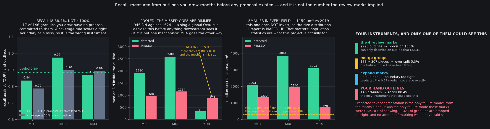

*Left: 88.4%, and why a coverage rule is the wrong instrument for it. Middle and right: what the missed granules have in common - dimmer and smaller, with M04 inverting the brightness half, so it is two mechanisms rather than one. Right: the four instruments, and which of them could possibly have seen this.*

**What I need from you:** **You were right to say something, and the useful part is that you did not have to do anything else.** The tool is fixed, but the number came from work you had already done.

One thing worth your eye when convenient: I can render the 17 missed granules as a contact sheet. If they look like real granules to you then 88.4% stands; if some are debris you outlined generously, recall is better than that and I would rather know which.

Next I wire p(void) in place of the Otsu mask and re-measure recall on these same 146 outlines. That is a real test with a stated prediction, and it can fail.

Still nothing committed.

---

## `e075` My e074 diagnosis fails its own test - the Otsu cut was worth 2 granules in 146 - and the sweep exposes a conflict no threshold can resolve

*FOUND — **CONFIRMED** · 2026-08-06 17:15:42*

I said in e074 that the global Otsu cut was why 17 granules go missing, and that replacing it with p(void) would raise recall. **I ran that test. It is worth 2 granules in 146, so the diagnosis is wrong.**

The comparison is at a **matched operating point** — the p(void) cut that declares the SAME foreground area as Otsu. Without that, 'recall went up' only means 'I called more of the image foreground', and nothing downstream changed: same seed rule, same landscape, same size floor. The mask was the only variable.

```
                        recall    coverage   fused   foreground
Otsu (shipped)           0.884      0.768      6      2.736 mm2
p(void), matched area    0.897      0.775      6      2.736 mm2   <- +2 granules
p(void) at 0.50          0.904      0.825      6      3.101 mm2
```

**One real thing did survive.** At a cut of 0.50, p(void) beats Otsu on recall AND on coverage with the SAME number of fused pairs — for 13% more foreground. Modest, but it is a genuine improvement on both axes at no cost in fusion, and I will take it.

**Why:** **THE SWEEP FOUND SOMETHING MUCH MORE IMPORTANT THAN THE THING I WAS TESTING.** Coverage and detection are in DIRECT CONFLICT, and no threshold escapes it:
> 
> ```
> p(void) cut   recall   coverage   granules fused   proposals
>    0.30        0.879     0.727           6           1451
>    0.50        0.904     0.825           6           1653
>    0.70        0.808     0.928          20           1748
>    0.80        0.726     0.979          34           1561
>    0.88        0.007     1.000         142              7
> ```
> 
> Fixing the boundary bias you marked 93 times — driving coverage from 0.77 toward 1.0 — **destroys detection, all the way to zero.** The mechanism is visible in the last two columns and is not subtle: as the mask loosens, MORE material becomes FEWER objects. Neighbouring granules fuse into one blob, and one blob gets one label. Proposals fall from 1748 to 7 while foreground more than doubles.
> 
> **This is structural, not a tuning failure.** A threshold answers one question — is this pixel material — and is then asked to serve a second question it was never given evidence about, which is where one object ends and the next begins. No better-calibrated threshold fixes that, which is why the +2 result is the RIGHT answer rather than a disappointing one: p(void) is a better-calibrated threshold, and a better threshold was never going to be enough.
> 
> **AND IT SHARPENS THE ARCHITECTURE INTO SOMETHING THAT CAN FAIL.** The surface-energy term is precisely a second source of evidence about where one object ends: it costs area to put a boundary anywhere, so two granules stay apart even when their material is contiguous. That predicts the energy field must reach HIGH COVERAGE AND HIGH DETECTION AT ONCE — a point ABOVE the curve in the left panel, which a threshold provably cannot reach. This is now the pre-registered test for step 7, and the curve is the benchmark. If the energy field lands ON that curve, the architecture buys nothing and I will report that.
> 
> **A note on how this went.** I made a diagnosis, wrote it into the plan as a prediction, and it failed within a day. That is the loop working: the previous version of me would have written 'replace the Otsu mask with p(void)' into the plan as an improvement and never checked what it bought.

| | value | note |
|---|---|---|

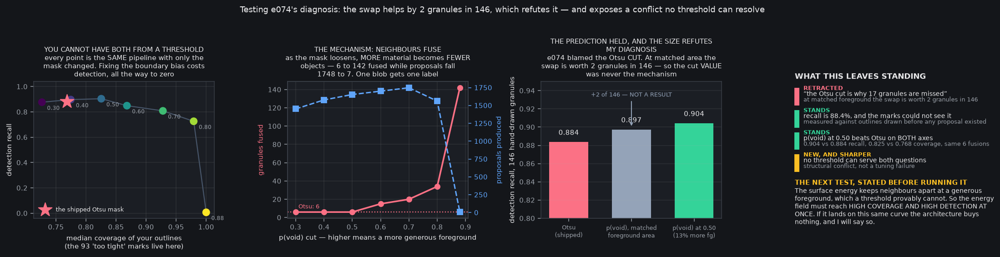

*Left: the frontier. Every point is the same pipeline with only the mask changed, and the star is what ships - fixing the boundary bias costs detection all the way to zero. Middle: the mechanism, neighbours fusing as the mask loosens. Third: my prediction, scored honestly at +2 of 146. Right: what survives, and the next test.*

**What I need from you:** **Nothing needed from you.** This was a prediction I wrote into the plan yesterday and it failed today, which is the loop doing its job rather than a setback.

The useful consequence is that step 7 now has a pre-registered benchmark that is a CURVE rather than a number, so 'the energy field is better' has to mean 'it reaches a point a threshold cannot' — which is a claim that can be wrong.

Still open when you have a moment: the contact sheet of the 17 missed granules, so you can tell me whether they are real granules or debris I should not have counted against myself.

Still nothing committed.

---

## `e076` The 17 missed granules, shuffled with 17 size-matched controls - are they granules?

*NEEDS YOU — **AWAITING YOUR CALL** · 2026-08-06 17:17:50*

88.4% rests on **17 objects**. If some of them are debris you outlined generously, recall is better than I reported and the size bias is smaller — and you are the only one who can say. So here they are, at a common scale, in the same fixed colour map you annotated in.

**White dashed = your outline. Green = what my pipeline actually produced there.**

**34 panels, not 17.** Each missed granule is paired with one I DID find, matched on area and shuffled, so you cannot tell from the layout which is which. A sheet of nothing but my failures asks you to agree with me, and agreement is not evidence. The size matching matters too: an unmatched control would be a typical granule, which would make every missed one look small for reasons that have nothing to do with whether it is a granule.

**Why:** **A NUMBER THIS SMALL SHOULD NOT BE BANKED WITHOUT LOOKING.** 17 objects is few enough that a handful of judgement calls moves recall by several points — if 5 of them are debris then recall is 92%, not 88%. That is exactly the standing rule from the size-prior failure: a measurement feeding a structural decision gets rendered and checked by eye before it becomes a default. This one is already feeding two decisions — the step-7 acceptance curve and the claim that my size distribution is biased upward.
> 
> **And the sheet is built so it can DISAGREE with me.** The controls are real detections at matched size, so if you mark roughly half the panels as 'not a granule' with no relation to which ones I missed, that tells me your outlines include a lot of marginal material and the 88.4% is measuring my agreement with your generosity rather than my recall. If instead the 'not a granule' calls land on the ones I missed, my number is if anything pessimistic. Both outcomes are informative and I do not know which it will be.
> 
> **What I can already see, and am NOT scoring.** Several outlines have no green line anywhere near them and sit on visibly dim red material — the pattern e074 measured (946 DN against 1624). That is my eye, not a measurement, and the reason to ask you rather than conclude it.

| | value | note |
|---|---|---|

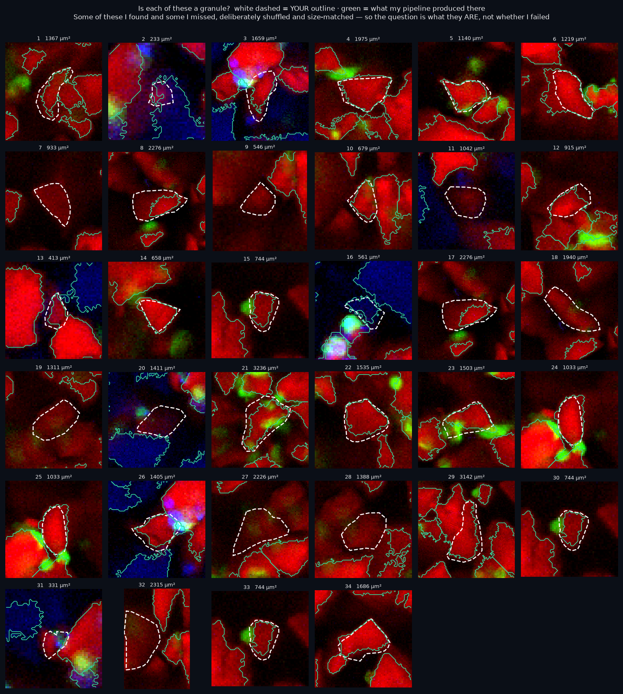

*Each panel: white dashed is YOUR outline, green is what my pipeline produced there. Some I found, some I missed, shuffled and size-matched. The number above each is its sectional area.*

**What I need from you:** **Just the numbers that are NOT granules.** Debris, haze, a piece of a neighbour, or anything you would not want counted as an object — a bare list like `2, 9, 13` is perfect, and "they all look like granules" is a complete answer too.

If it is useful: a panel with a white outline and NO green line means I produced nothing there at all. A panel where green cuts across the white outline is a different defect (I split it), not a miss.

I will post the missed/found split next to your calls, so we both find out whether the sheet agreed with me.

---

## `e077` You were right about 7 of the 17 - recall is 93.2% over the stack, and the other 10 turn out to be two different problems

*FOUND — **CONFIRMED** · 2026-08-06 17:31:26*

"Not debris — real granules, just out of focus." That is a claim about the THIRD axis, and it is refutable in a way "they look dim" is not: an out-of-focus object is in focus SOMEWHERE ELSE. There are 7 z planes and everything so far has been measured on one of them.

**You are right about 7 of the 17.** At z=3 they show **46% of their own peak brightness** and only **9.8% of your outline is foreground** there, against 79.8% for a detected granule. They are barely present at this plane. The unchanged pipeline finds all 7 at another z.

**So the number I reported was the wrong number.** 88.4% is a property of my choice of plane, not of the pipeline:

```
recall, one plane (what I reported)   0.884
recall, the stack, same pipeline      0.932
```

**The other 10 are a different problem, and your explanation does not cover them.** Their brightness PEAKS at z=3 — this is their best plane — and 62% of each outline is already foreground. They are in focus, present, and still missed.

**Why:** **17 MISSES, THREE MECHANISMS, THREE DIFFERENT FIXES.** The value of your answer was not that it was right; it is that testing it split one number into three problems that were hiding inside each other:
> 
> * **7 out of focus** — an artefact of analysing a single plane. Fixed by asking the stack, and already fixed: 93.2%.
> * **5 ABSORBED into a brighter neighbour** — their pixels ARE foreground, they are contiguous with a bigger granule, one seed lands and one label comes out. This is exactly what the surface-energy term exists for, and step 7 now has five NAMED granules it must recover.
> * **5 with no proposal at any plane** — genuinely unsolved, and e075 already showed no threshold fixes them.
> 
> **The 5/5 is a TIE at n=10 and I am not calling either one the cause.** My script's own verdict line said "absorption dominates" on a 5-5 split, which is the kind of sentence that becomes a quoted fact three entries later. Fixed before it could.
> 
> **A STATISTIC OF MINE RETRACTED, AND IT FAILED IN AN INSTRUCTIVE WAY.** My first focus test asked "is the sharpest plane different from z=3?" and got **100% for BOTH groups**. That is not a finding, it is the null: with 7 planes, an argmax over noisy values misses the centre ~86% of the time by chance. A statistic that returns 100% for the group it is supposed to separate AND for the control has measured nothing, and the identical answer for both is what gave it away. Replaced with **value(z=3) / max over z** — a ratio to the object's own peak, which needs no argmax and immediately separated them 0.455 against 0.969.
> 
> **And the acquisition is visible underneath all of it.** A granule is detected in a median of **3 of 7 planes**. At a 40 um z step against 50-70 um granules, an object can sit between planes and be well-sampled by neither — the same 40 um that ceilings the boundary confidence at ~0.55. This is not a pipeline defect and no amount of work here removes it.

| | value | note |
|---|---|---|

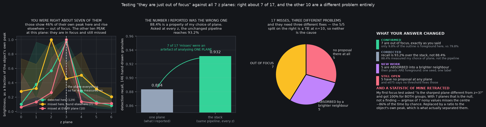

*Left: brightness against z as a fraction of each object's own peak. The amber group dips at the plane I measured on and rises elsewhere - out of focus, as you said. The red group PEAKS there. Middle: the recall correction. Right: 17 misses splitting into three separate problems, and the statistic I had to throw away.*

**What I need from you:** **Your one sentence was worth more than the contact sheet was.** It corrected the headline number, and testing it turned one figure into three problems with three different owners.

Nothing needed from you. Step 7 now has a concrete target that is not a percentage: **five named granules that are absorbed into a brighter neighbour**, plus the coverage/detection curve from e075 that it has to beat. Both can fail.

One thing I want to flag rather than bury: **going to the full stack is not free**. Everything calibrated so far - p(void), the boundary confidence, the cell term - was fitted on single planes. If the pipeline moves to 3D those need re-checking rather than assuming, and I would rather say that now than discover it later.

Still nothing committed.

---
